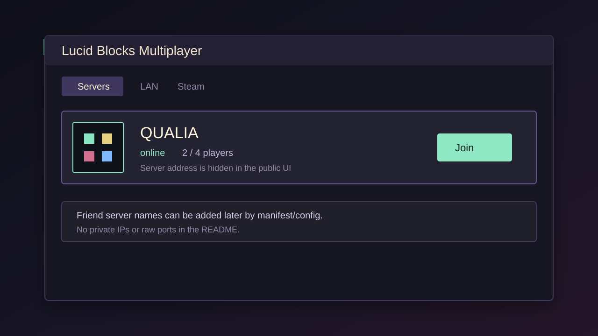
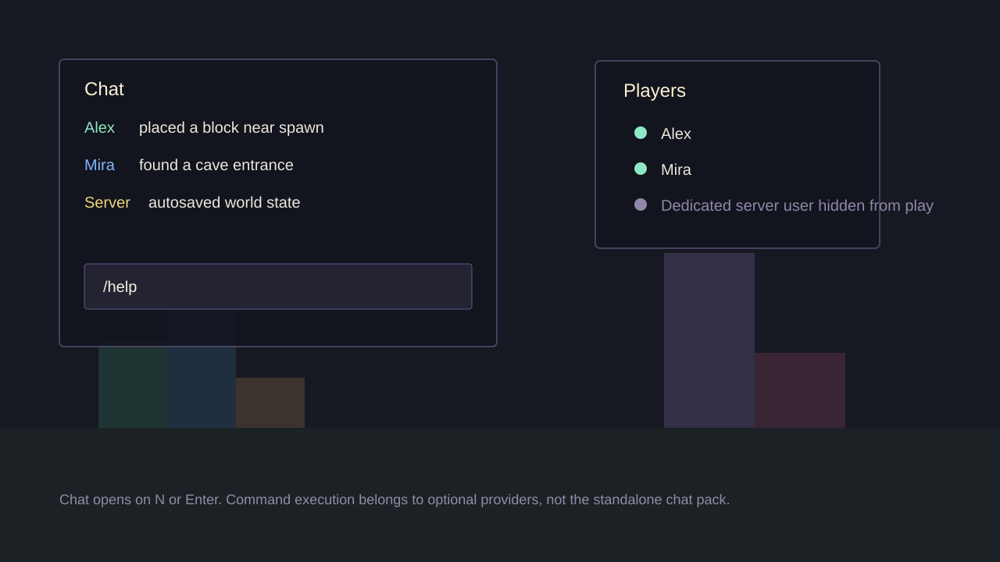
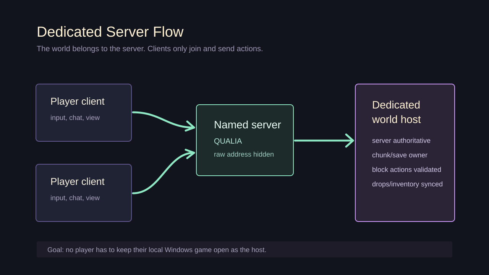

# Lucid Blocks Multiplayer / Chat / Console Mods

Experimental mods for Lucid Blocks.



The project is being split into three packages:

- `lucid-blocks-multiplayer.pck` - server-based multiplayer and dedicated server work.
- `lucid-blocks-chat.pck` - standalone in-game chat UI.
- `lucid-blocks-console.pck` - singleplayer/LAN command console work on top of chat.

The current source still contains some historical overlap. See [MOD_SPLIT.md](MOD_SPLIT.md) for the split plan and release boundaries.

## Attribution

This is an unofficial fork/continuation of the community co-op mod originally
published at https://github.com/parkers0405/lucid-blocks-coop by Parker Settle /
Mr_Settle. We do not claim authorship of the original co-op mod, Lucid Blocks, or
bundled third-party tools/assets.

Full credits and release attribution rules are in [CREDITS.md](CREDITS.md).

## Screenshots

These are illustrated UI screenshots for the current MVP direction. They avoid
private endpoints and show the intended public flow.





## Status

This is not a polished public release yet.

Current priorities:

- keep singleplayer safe;
- remove debug/cheat commands from the multiplayer core package;
- keep chat standalone and reusable;
- make the console pack work standalone without the multiplayer manager;
- fix autocomplete;
- make Linux dedicated setup reproducible;
- document public releases without exposing private server endpoints.

## Packages

### Multiplayer

Target file:

```text
dist/lucid-blocks-multiplayer.pck
```

Includes:

- multiplayer/dedicated connection flow;
- server browser;
- player list;
- multiplayer integration with the chat pack;
- safe default remote avatar;
- server-world protection.

Does not include, for release:

- `/give`, `/gamemode`, `/spawn`, `/time`, `/weather`, `/kill`, `/fly`;
- questionable/fan avatar packs;
- camera/zoom hotkeys;
- private server endpoints in docs/UI.

### Chat

Target file:

```text
dist/lucid-blocks-chat.pck
```

Goal:

- in-game chat UI;
- chat history;
- input handling;
- command-style text entry shell;
- autocomplete UI shell.

Chat should not execute cheats by itself. It should call optional multiplayer/console providers when those packs are installed.

### Console

Target file:

```text
dist/lucid-blocks-console.pck
```

Goal:

- singleplayer commands on top of chat;
- LAN host admin/debug commands;
- command autocomplete provider.

Note: the console pack is not a real standalone release yet. Command execution still needs to be split out of `coop_manager` into `mod/console_overrides`.

## Build

Windows PowerShell:

```powershell
Set-ExecutionPolicy -Scope Process -ExecutionPolicy Bypass -Force
.\scripts\build_release_packs.ps1
```

Windows cmd:

```bat
scripts\build_release_packs.cmd
```

Linux/macOS shell:

```bash
GODOT_EXPORT_BIN=/path/to/Godot_v4.6-stable_linux.x86_64 ./scripts/build_release_packs.sh
```

## Install

Copy the `.pck` file into one of the Lucid Blocks mod directories, depending on your install:

```text
SteamLibrary/steamapps/common/lucid-blocks/mods
SteamLibrary/steamapps/common/lucid-blocks/lucid-blocks/mods
```

Do not install old mixed/debug packages together with release packages unless you are intentionally testing conflicts.

Friend install guide:

- Russian: [docs/FRIEND_INSTALL_RU.md](docs/FRIEND_INSTALL_RU.md)

## Dedicated Server Docs

- Russian: [docs/LINUX_SERVER_RU.md](docs/LINUX_SERVER_RU.md)
- English: [docs/LINUX_SERVER_EN.md](docs/LINUX_SERVER_EN.md)

## Roadmap

The living roadmap is [SERVER_ROADMAP.md](SERVER_ROADMAP.md).

## GitHub Publishing

Before publishing, read [docs/GITHUB_PUBLISHING.md](docs/GITHUB_PUBLISHING.md).

Do not publish private deployment files, passwords, IPs, ports, Steam credentials, or server config.

## License / Assets

License is still TODO.

Do not ship assets with unclear rights in the main public package. The default blocky avatar has attribution in `avatar_assets/rigged_default/ATTRIBUTION.md`; other test/fan avatars should move to optional forks/addon packs before public release.
