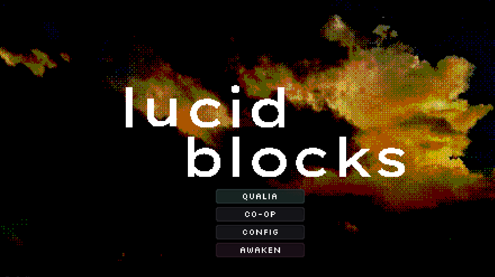
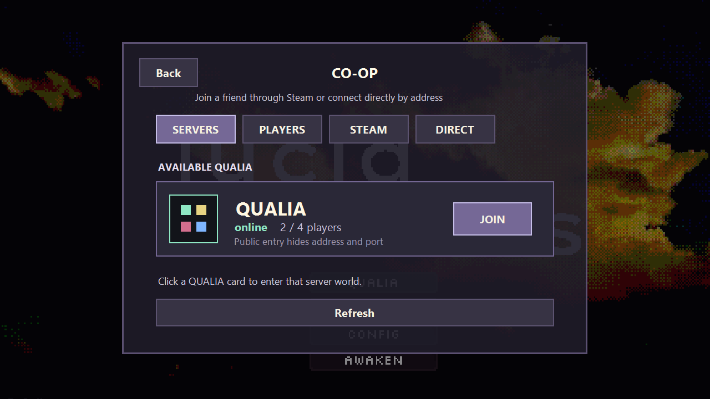
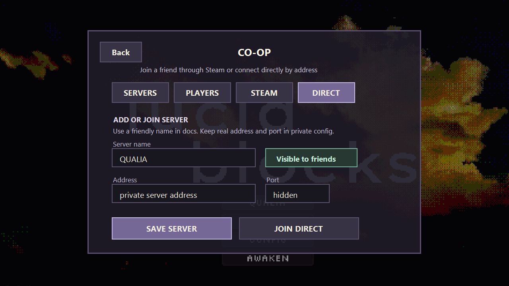
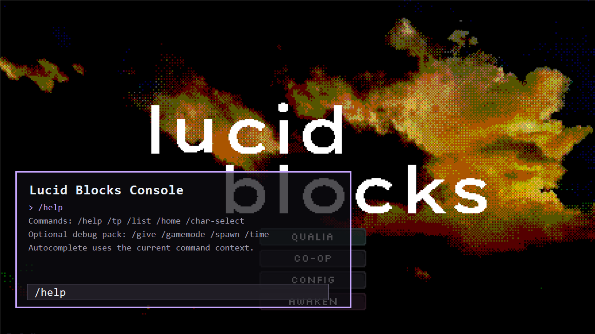
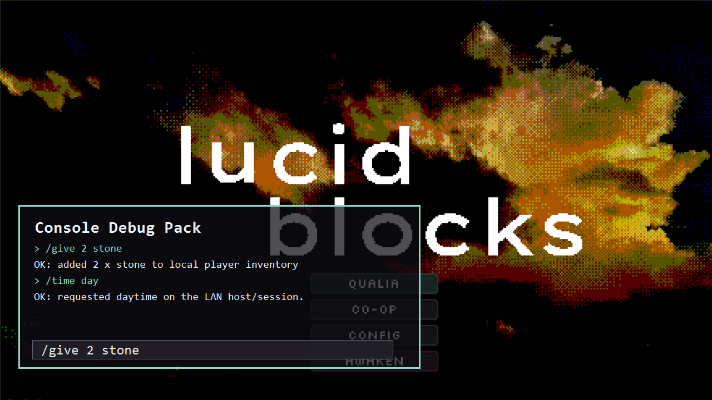

# Lucid Blocks Multiplayer

Unofficial Lucid Blocks multiplayer mod focused on dedicated servers, named
QUALIA server discovery, server-owned worlds, chat, and admin/builder tooling.

Russian overview: [README_RU.md](README_RU.md)



This repository is a fork/continuation of the community co-op mod. It requires a
legal copy of Lucid Blocks and is not affiliated with the game developers.

## Packages

- `lucid-blocks-multiplayer.pck` - server-based multiplayer and dedicated server work.
- `lucid-blocks-chat.pck` - standalone in-game chat UI.
- `lucid-blocks-console.pck` - singleplayer/LAN command console work on top of chat.

The current source still contains some historical overlap. See [MOD_SPLIT.md](MOD_SPLIT.md) for the split plan and release boundaries.

## Current MVP

The current MVP is a server-authoritative multiplayer package:

- clients join from the in-game `CO-OP` server browser;
- the dedicated host owns the world save;
- block, item, water, fire, storage and entity actions are validated by the server;
- server-only worlds are hidden/blocked from normal singleplayer flows;
- status and logs expose TPS, RAM, players, packet backlog, chunk tickets and dirty journal state.

Known limits:

- gameplay transport is Godot ENet/UDP, not QUIC;
- Linux/Proton dedicated hosting can still pay rendering cost because Lucid Blocks is not a native headless server;
- multi-region chunk loading is implemented through GDScript tickets plus an optional native hook, not a full C++ `LucidBlocksWorld` rewrite yet;
- public release packaging still needs a final license decision.

## Attribution

This is an unofficial fork/continuation of the community co-op mod originally
published at https://github.com/parkers0405/lucid-blocks-coop by Parker Settle /
Mr_Settle. We do not claim authorship of the original co-op mod, Lucid Blocks, or
bundled third-party tools/assets.

Full credits and release attribution rules are in [CREDITS.md](CREDITS.md).

## Screenshots

Player-facing screenshots are kept in `docs/assets/screenshots`. Release notes
and friend packages should use those PNGs first, not diagrams.






Console/debug pack screenshots:





## Status

This is an experimental MVP, not a polished public release yet.

Current priorities:

- keep singleplayer safe;
- keep debug/cheat commands out of the public multiplayer core package unless
  server-side admin roles explicitly allow them;
- keep chat standalone and reusable;
- keep the console pack standalone without the multiplayer manager;
- make Linux dedicated setup reproducible;
- document public releases without exposing private server endpoints.

## Architecture

Full technical notes: [docs/ARCHITECTURE.md](docs/ARCHITECTURE.md).

### Network Protocols

- Game session: Godot high-level multiplayer RPC over ENet/UDP.
- Protocol identity: `lucid-blocks-coop`, version `1`, minimum compatible `1`.
- Dedicated health/status: small UDP endpoint returning JSON.
- Server browser registry: local JSON plus optional HTTP/HTTPS remote registry.
- Steam lobbies: legacy invite/discovery path, not the dedicated server model.
- QUIC: not implemented in this MVP.

### Server Authority And Security

The dedicated server is the source of truth for world mutation and persistence.
Clients request actions; the server validates, applies, journals and acknowledges
them. Debug commands are denied by default. Builder commands require server-side
admin role validation.

Client safety checks cap incoming snapshot sizes, text length, entity/drop
counts, coordinates, damage and knockback. Client-side scene spawning is
restricted to allowed resource prefixes. The server does not intentionally ask a
client to execute arbitrary code.

Server save sealing is an ownership guard, not DRM. It prevents accidental
singleplayer editing of server worlds, but real server security still depends on
host filesystem permissions and private config hygiene.

### Chunk Loading And Interest Management

Lucid Blocks originally streams the world around one center. The mod adds
server-side chunk tickets:

- player tickets for connected players;
- short-lived action tickets for block, foliage, water, fire, storage, item and
  resync work;
- ticket priorities and TTL cleanup;
- optional native multi-region hook when available;
- single-center fallback when the hook is unavailable.

Entity/drop snapshots are filtered by active instance and distance so small
servers do not broadcast every object to every player. Clients keep short grace
windows for recently seen drops/entities to avoid visual flicker while snapshots
catch up.

### Persistence

Dedicated servers track dirty chunks and append authoritative cell changes to a
chunk journal. Journal replay runs during startup before the server advertises
ready status. Dirty chunks are flushed/compacted by dedicated autosave logic.

Tracked journal state currently covers block cells, water, fire and storage
inventories.

## Multiplayer

Target file:

```text
dist/lucid-blocks-multiplayer.pck
```

Includes:

- multiplayer/dedicated connection flow;
- server browser;
- player list;
- multiplayer integration with the chat pack;
- safe default remote avatar;
- server-world protection;
- server-side admin roles for controlled builder/world-edit commands.

Does not include, for release:

- public access to `/give`, `/gamemode`, `/spawn`, `/time`, `/weather`, `/kill`, `/fly`;
- questionable/fan avatar packs;
- camera/zoom hotkeys;
- private server endpoints in docs/UI.

Admin-only multiplayer commands:

- `/whoami` shows the server-side role and `player_key` for the current player.
- Add admin keys to the dedicated server with `LB_ADMIN_KEYS="steam_...__suffix,mock_..."`
  or launch args `--lb-admin-keys="key1,key2"`.
- Admins can use `/wand`, `/pos1`, `/pos2`, `/sel`, `/fill`, `/clear`,
  `/floor`, `/flat`, `/border`, `/peaceful`, `/daylock`, `/builder_setup`.
- Builder commands are executed by the server after role validation. Clients do
  not directly edit the authoritative world.

### Chat

Target file:

```text
dist/lucid-blocks-chat.pck
```

Goal:

- in-game chat UI;
- chat history;
- input handling;
- command-style text entry shell;
- autocomplete UI shell.

Chat should not execute cheats by itself. It should call optional multiplayer/console providers when those packs are installed.

### Console

Target file:

```text
dist/lucid-blocks-console.pck
```

Goal:

- singleplayer commands on top of chat;
- LAN host admin/debug commands;
- command autocomplete provider.

The console pack is now a standalone optional debug/admin pack in
`mod/console_overrides`. It reuses the chat UI and provides its own command
provider instead of relying on `coop_manager`.

Builder/admin commands:

- `/wand`, `/pos1`, `/pos2`, `/sel`
- `/fill <block>`, `/clear [water]`, `/floor <block> [y]`
- `/flat [radius_chunks] [block] [y]`
- `/border [radius_chunks] [block] [height]`
- `/peaceful [on|off]`, `/daylock [on|off]`
- `/builder_setup [radius_chunks] [block] [y]`

`/builder_setup` prepares a spawn-building area: creative/fly, day lock,
peaceful mode, a flat loaded chunk area, and a physical border wall.

Screenshots:


## Build

Windows PowerShell:

```powershell
Set-ExecutionPolicy -Scope Process -ExecutionPolicy Bypass -Force
.\scripts\build_release_packs.ps1
```

Windows cmd:

```bat
scripts\build_release_packs.cmd
```

Linux/macOS shell:

```bash
GODOT_EXPORT_BIN=/path/to/Godot_v4.6-stable_linux.x86_64 ./scripts/build_release_packs.sh
```

## Install

Copy the `.pck` file into one of the Lucid Blocks mod directories, depending on your install:

```text
SteamLibrary/steamapps/common/lucid-blocks/mods
SteamLibrary/steamapps/common/lucid-blocks/lucid-blocks/mods
```

Do not install old mixed/debug packages together with release packages unless you are intentionally testing conflicts.

Friend install guide:

- Russian: [docs/FRIEND_INSTALL_RU.md](docs/FRIEND_INSTALL_RU.md)

## Dedicated Server Docs

- Russian: [docs/LINUX_SERVER_RU.md](docs/LINUX_SERVER_RU.md)
- English: [docs/LINUX_SERVER_EN.md](docs/LINUX_SERVER_EN.md)
- Server registry: [docs/SERVER_REGISTRY.md](docs/SERVER_REGISTRY.md)
- Logs and health checks: [docs/SERVER_LOGS.md](docs/SERVER_LOGS.md)

## Roadmap

The living roadmap is [SERVER_ROADMAP.md](SERVER_ROADMAP.md).

## GitHub Publishing

Before publishing, read [docs/GITHUB_PUBLISHING.md](docs/GITHUB_PUBLISHING.md).

Do not publish private deployment files, passwords, IPs, ports, Steam credentials, or server config.

Generated folders such as `.godot/`, `logs/`, `backups/`, `__pycache__/`,
native build caches, and temporary `dist/.tmp-*` files should stay out of Git.

## License / Assets

License is still TODO.

Do not ship assets with unclear rights in the main public package. The default blocky avatar has attribution in `avatar_assets/rigged_default/ATTRIBUTION.md`; other test/fan avatars should move to optional forks/addon packs before public release.
