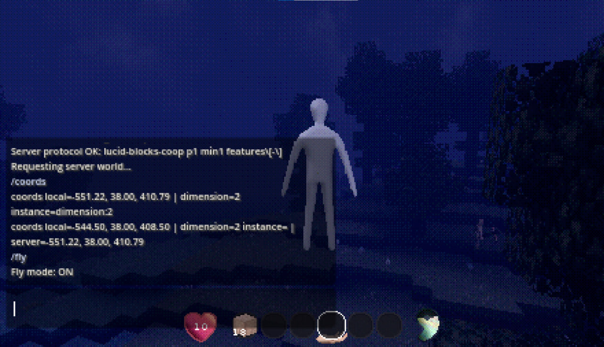
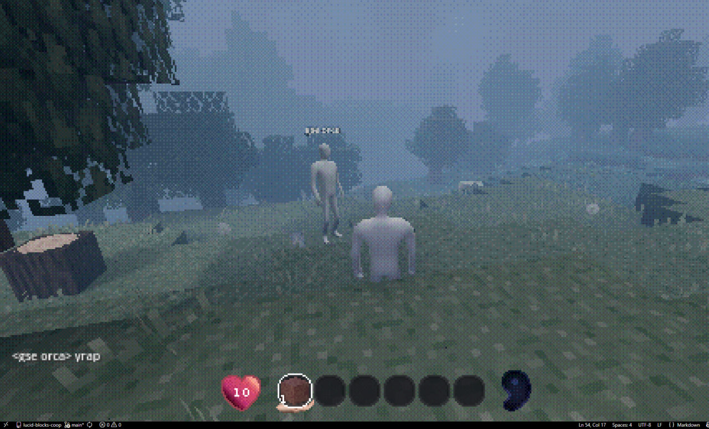
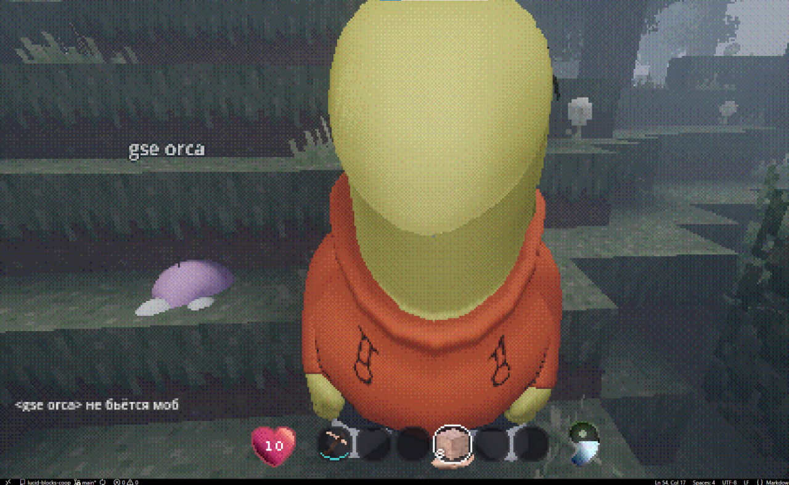

# Lucid Blocks Multiplayer

Неофициальный multiplayer-мод для Lucid Blocks с упором на выделенные серверы,
список QUALIA-серверов, серверные миры, чат и админские инструменты.

Текущая публичная версия: **v0.1.0-mvp**

English README: [README.md](README.md)


Это неофициальный форк/продолжение community co-op мода. Для игры нужна
легальная копия Lucid Blocks. Проект не связан с разработчиками или издателем
игры.

## Пакеты

- `lucid-blocks-multiplayer.pck` - выделенный/серверный multiplayer.
- `lucid-blocks-chat.pck` - отдельный внутриигровой чат.
- `lucid-blocks-console.pck` - отдельная консоль команд для singleplayer/LAN и админских задач.

## Что есть в v0.1.0-mvp

- Кнопка `CO-OP` в главном меню.
- Список доступных QUALIA-серверов в стиле меню игры.
- Подключение кликом по карточке сервера.
- Миром владеет dedicated server, а не игрок-хост.
- Сервер валидирует запросы на блоки, предметы, воду, огонь, хранилища, урон и сущности.
- Базовое сохранение персонажа и защита повторного входа.
- Чат и строка команд.
- Отображаемые аватары игроков с безопасным дефолтным телом.
- Статус сервера: TPS, игроки, RAM, backlog пакетов, dirty journal, chunk tickets.
- Серверные сейвы помечаются как server-only и не должны открываться через singleplayer.


## Текущие ограничения

Это экспериментальный MVP, а не официальный polished multiplayer.

- Dedicated server все еще запускается через игру/Proton, поэтому это не настоящий headless-сервер без рендера.
- Время/погода, поведение мобов и reconciliation предметов требуют дальнейшего тестирования.
- Большие публичные сервера пока не цель. Сейчас мод рассчитан на маленькие приватные серверы.
- Нативный загрузчик мира Lucid Blocks изначально сделан вокруг одного центра загрузки. Мод добавляет chunk tickets и optional native hook как совместимый слой.
- Тестовые/fan аватары в исходниках не считаются частью безопасного публичного core-релиза, если их права не очищены отдельно.

## Скриншоты








## Установка для игрока

1. Закрой Lucid Blocks.
2. Открой папку игры в Steam: `Library -> Lucid Blocks -> Manage -> Browse local files`.
3. Создай папку `mods`, если ее нет.
4. Удали старые тестовые co-op/multiplayer `.pck`, если они лежат рядом.
5. Скопируй `dist/lucid-blocks-multiplayer.pck` в `mods`.
6. Запусти игру.
7. Нажми `CO-OP`.
8. Нажми на карточку сервера в `AVAILABLE QUALIA`.

Подробная инструкция для друга: [docs/FRIEND_INSTALL_RU.md](docs/FRIEND_INSTALL_RU.md)

## Свой сервер

Свой dedicated server поднимается на Linux и может публиковаться через
registry/master-server, чтобы игрокам не приходилось вручную вводить IP и порт.

- Инструкция RU: [docs/LINUX_SERVER_RU.md](docs/LINUX_SERVER_RU.md)
- Instruction EN: [docs/LINUX_SERVER_EN.md](docs/LINUX_SERVER_EN.md)
- Логи и health-check: [docs/SERVER_LOGS.md](docs/SERVER_LOGS.md)
- Registry/master-server: [docs/SERVER_REGISTRY.md](docs/SERVER_REGISTRY.md)

Не публикуй приватные deploy-файлы, пароли, токены, живые IP, порты, Steam
credentials и локальные логи.

## Как работает сеть

Подробнее: [docs/ARCHITECTURE.md](docs/ARCHITECTURE.md)

- Игровая сессия работает через Godot high-level multiplayer RPC поверх ENet/UDP.
- Protocol identity: `lucid-blocks-coop`.
- Protocol version: `1`.
- Совместимость проверяется по protocol/min-compatible и feature gates, а не по точному PCK hash или косметическому build tag.
- Health/status dedicated server отвечает маленьким JSON по UDP.
- Server browser берет список из локального JSON и optional HTTP/HTTPS registry.
- Steam lobbies остаются legacy-путем для invite/discovery, но dedicated model использует список серверов.

## Серверная авторитетность и безопасность

Dedicated server - источник истины для мира и сохранения. Клиент отправляет
request, сервер валидирует, применяет, пишет journal и отправляет ack/resync.

Текущая модель безопасности:

- Debug/cheat команды выключены по умолчанию.
- Builder-команды доступны только через серверную проверку admin role.
- Клиент не должен выполнять произвольный код от сервера.
- Входящие snapshots, текст, количество drops/entities, координаты, урон и knockback ограничены.
- Спавн сцен на клиенте ограничен разрешенными resource prefixes.
- Server-only сейвы скрываются/блокируются от обычного singleplayer.

Печать/секрет server save - это защита от случайного локального редактирования,
а не DRM. Реальная безопасность зависит от прав файловой системы, хоста и
приватности конфигов.

## Чанки и сохранение

Lucid Blocks изначально грузит мир вокруг одного центра. Для multiplayer мод
добавляет:

- player tickets вокруг подключенных игроков;
- short-lived action tickets для блоков, foliage, воды, огня, storage, предметов и resync;
- priorities и TTL cleanup;
- optional native multi-region hook;
- fallback к одному центру, если hook недоступен.

Сервер пишет авторитетные изменения в chunk journal. При старте dedicated server
делает replay journal до публикации `ready`. Dirty chunks дальше flush/compact
через dedicated autosave.

## Сборка

PowerShell:

```powershell
Set-ExecutionPolicy -Scope Process -ExecutionPolicy Bypass -Force
.\scripts\build_release_packs.ps1
```

Проверка перед публикацией:

```powershell
Set-ExecutionPolicy -Scope Process -ExecutionPolicy Bypass -Force
.\scripts\check_release_hygiene.ps1
git diff --check
git status --short
```

## Перед открытием репозитория

- Не публиковать `deploy.txt`, `.env`, пароли, токены, приватные IP/порты и локальные логи.
- Оставить [CREDITS.md](CREDITS.md).
- Не выдавать оригинальный co-op mod за свой.
- Не класть fan/test аватары в release archives без очищенных прав.
- Использовать реальные скриншоты из `docs/assets/screenshots`, не мокапы.

## Атрибуция

Оригинальный community co-op mod:
https://github.com/parkers0405/lucid-blocks-coop by Parker Settle / Mr_Settle.

Полные credits и notes по ассетам: [CREDITS.md](CREDITS.md)
