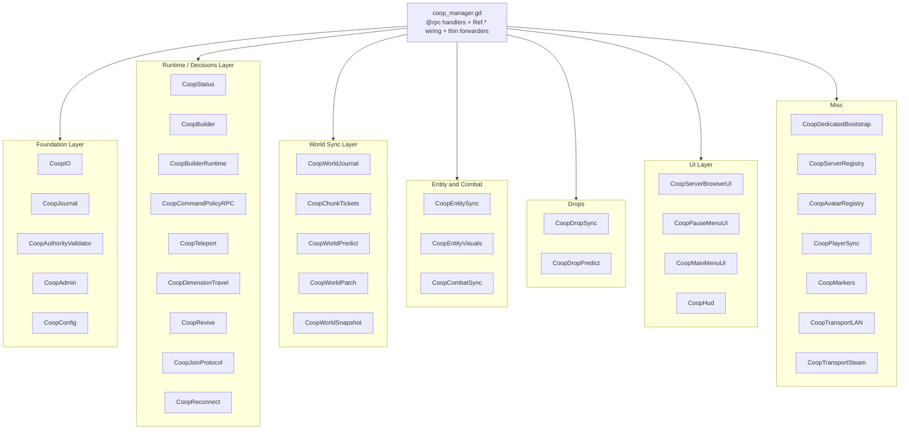

# Architecture

This document describes the current multiplayer MVP as implemented in
`mod/overrides/coop_mod/coop_manager.gd`. It is intentionally practical rather
than aspirational.

## Current Scope

The mod turns the original community co-op experiment into a server-authoritative
multiplayer flow:

- clients join a named QUALIA server from the in-game browser;
- the dedicated host owns the world save and applies block/item/entity changes;
- clients render local prediction where possible, then reconcile to server state;
- server worlds are marked as server-only so players do not open and edit them
  through singleplayer by accident.

This is a Godot mod layered over the existing game. The repository keeps the
implemented multiplayer hooks, server authority, chunk tickets and persistence
path in the mod layer.

## Network Transports

### Game Session

Gameplay uses Godot high-level multiplayer RPCs over ENet/UDP. The active
protocol identity is:

```text
COOP_PROTOCOL_NAME = lucid-blocks-coop
COOP_PROTOCOL_VERSION = 1
COOP_PROTOCOL_MIN_COMPATIBLE = 1
```

Compatibility should be handled through protocol/min-compatible checks and
feature gates, not by requiring every client build hash to match exactly.
The game/mod build version may be shown in diagnostics, but it must not be used
as a hard join gate. Cosmetic client patches should remain compatible with an
already deployed dedicated server unless the protocol contract or required
feature set changes.

Steam lobbies are treated as a discovery/invite path for legacy co-op flows.
Dedicated server play should use named server entries from the server browser.

### Status Endpoint

Dedicated servers expose a lightweight UDP status endpoint. It accepts simple
status requests such as:

```text
status
ping
health
{"type":"status"}
```

The response is JSON and includes fields such as `ready`, `boot_phase`, `players`,
`tps`, `ram_mb`, `packet_backlog`, `dirty_journal_backlog`,
`loaded_region_count`, and `chunk_ticket_count`.

### Server Registry

The server list is loaded from:

1. built-in defaults, which should stay empty in public builds;
2. local `user://lucid_blocks_server_registry.json`;
3. optional remote `server_registry_url`.

The registry is JSON over HTTP/HTTPS. Linux servers can publish heartbeat data to
a small master registry service in `scripts/linux/lucid_blocks_master_server.py`.

Player-facing UI shows server names, world names, status, players and TPS. Raw
addresses and ports are not shown on cards or in public docs.

## Server Authority

The dedicated host is the source of truth for:

- world save ownership;
- block place/break/foliage actions;
- water, fire and storage cell changes;
- dropped item pickup results;
- entity/player damage and rewards;
- admin/builder commands.

Clients send requests such as `request_place_block`, `request_break_block`,
`request_foliage_break`, `request_water_cells`, `request_fire_cell`,
`request_storage_inventory`, `request_entity_attack`, and item pickup requests.
The server validates the request, applies it if allowed, records world changes,
and sends acknowledgements or resync data back to the client.

Duplicate block and item requests are cached for a short time so repeated RPCs do
not duplicate inventory or world mutations.

## Security Model

This is a mod-level safety model, not a hardened anti-cheat system.

Current protections:

- server-side command policy defaults deny debug/cheat commands;
- admin-only builder commands require server-side role validation by `player_key`;
- clients do not directly execute arbitrary server-provided code;
- incoming snapshots and payloads are capped by size and count;
- client-side scene spawning is restricted to allowed resource prefixes;
- text, UUIDs, coordinates, damage and knockback values are clamped;
- server-only saves are sealed with metadata so they are hidden/blocked from
  normal singleplayer flows;
- player-facing UI and public docs hide raw endpoints.

The server save secret/seal is an ownership guard, not DRM. It reduces accidental
or casual local editing of a server world, but the server process still needs
normal filesystem and host security.

## World Streaming And Chunk Tickets

The base game world loader was designed around one loaded center. Multiplayer
needs several active areas: one per player plus short-lived action zones.

The current MVP uses a layered approach:

- player positions define active load centers;
- server chunk tickets hold chunks around recent actions such as block place,
  block break, foliage, water, fire, storage, item pickup and resync;
- tickets have owners, priorities and TTLs;
- if the native multi-region hook is available, active centers are pushed into
  the native patch;
- if the native hook is unavailable, the server falls back to the best single
  load focus to preserve compatibility.

This keeps far-apart players and delayed block actions more playable while
preserving compatibility with the current game build.

## Interest Management

The server does not try to send every entity and drop update to every client.
Current filtering is distance/instance based:

- peer snapshots are per active same-instance peer;
- entity visual snapshots are throttled per peer/entity;
- dropped item spawn RPCs are sent only to nearby interested peers;
- clients keep short grace windows for recently seen entities and drops to avoid
  flicker while snapshots catch up;
- far entities can be represented as low-frequency dummy state instead of fully
  simulated visuals.

The default MVP is tuned for small servers. Bigger player counts need more work
on AOI grids, entity ownership and native no-render dedicated mode.

## Persistence

The server tracks dirty world state by chunk/instance and records authoritative
cell changes in a chunk journal:

- block changes;
- water cells;
- fire cells;
- storage inventories.

On dedicated startup the server replays the journal before publishing ready
status. Dirty chunks are periodically flushed/compacted through dedicated
autosave logic. Status metrics expose `dirty_chunk_count`,
`dirty_journal_backlog`, and `chunk_journal_sequence`.

This is intended to avoid manual merging of player saves. The server save is the
world; clients should not edit that same save locally.

## Observability

Dedicated status and logs are part of the architecture, not debug leftovers.
Admins should watch:

- `tps`, `min_tps`, `tps_health`;
- `ram_mb`, `ram_peak_mb`;
- `players`, `max_players`;
- `packet_backlog`;
- `dirty_journal_backlog`;
- `loaded_region_count`, `chunk_ticket_count`;
- entity/drop counts and interest counters.

See [SERVER_LOGS.md](SERVER_LOGS.md) for commands and warning signs.

## Operational Limits

- Gameplay transport is ENet/UDP.
- Linux/Proton dedicated hosting can still pay rendering cost because the game
  was not built as a true headless server.

## God-Class Decomposition (in progress)

`coop_manager.gd` is large (~17k lines) and currently owns transport,
ingress validation, persistence, UI, status and admin features. The
audit-driven refactor extracts these into focused modules **without
breaking the network protocol**, which is tied to the script's NodePath
on the multiplayer authority.

Target topology (phase by phase):

- `CoopIO`                — atomic file IO, bounded dicts, primitive validators.
                            **Phase 1 complete** (`mod/overrides/coop_mod/coop_io.gd`).
- `CoopJournal`            — chunk journal append/replay/compact, applied-seq.
                            **Phase 2 complete** (`mod/overrides/coop_mod/coop_journal.gd`).
- `CoopAuthorityValidator` — reach/identity/admin/request-id checks shared
                             by every `@rpc("any_peer")` handler.
                             **Phase 3 complete** (`mod/overrides/coop_mod/coop_authority_validator.gd`).
- `CoopStatus`             — UDP status server payload builders + registry heartbeat URL/headers/throttle.
                             **Phase 4 complete** (`mod/overrides/coop_mod/coop_status.gd`). Engine-bound
                             state (Thread/Mutex/PacketPeerUDP/HTTPRequest) stays on `coop_manager.gd`;
                             payload-shaping and throttle decisions are pure.
- `CoopAdmin`              — admin keys parsing, command-name/policy normalization, command-set
                             classification, builder parsing primitives, selection / chunk-square
                             geometry, slugify.
                             **Phase 5 complete** (`mod/overrides/coop_mod/coop_admin.gd`). Engine-bound
                             world-edit dispatch (`Ref.world`, physics raycasts, `@rpc` handlers) stays
                             on `coop_manager.gd`; the command sets (`DEFAULT_SERVER_COMMAND_POLICY`,
                             `ADMIN_BUILDER_COMMAND_NAMES`, `CORE_DEBUG_COMMAND_NAMES`) also stay so the
                             source-of-truth does not fork.
- `CoopBuilder`            — builder world-edit engine (`_builder_fill_box`,
                             `_builder_set_world_block`, `_builder_make_flat_area`,
                             `_builder_build_border`, dirty-chunk collapse) wrapped behind a
                             `world_ops` Callable bag built by `_make_world_ops()`.
                             **Phase 6 complete** (`mod/overrides/coop_mod/coop_builder.gd`).
                             Engine-bound state (`Ref.world.*` method calls, the
                             `WORLD_EDIT_MAX_BLOCK_OPS` cap, `@rpc` handlers,
                             `notify_local_world_state_dirty(...)`) stays on
                             `coop_manager.gd`; the iteration / dispatch /
                             chunk-collapse logic is pure.
- `CoopBuilderRuntime`     — admin builder tick (`_tick_builder_admin_runtime`) +
                             peaceful entity sweep (`_apply_builder_peaceful_runtime`) +
                             day-time lock (`_set_builder_day_time`). Engine deps
                             (`multiplayer.is_server`, `_has_live_peer`, `Ref.entity_spawner`,
                             `Ref.player`, scene-tree `find_children` + `queue_free`,
                             `Ref.world.time_of_day`) injected as a Callable bag.
                             **Phase 7 complete** (`mod/overrides/coop_mod/coop_builder_runtime.gd`).
                             Tick decision math and the entity-despawn filter are pure;
                             engine-mutating calls (`queue_free`, spawner toggles, the
                             `Ref.world.time_of_day` write, the `_display_command_response`
                             feedback) stay on `coop_manager.gd`.
- `CoopCommandPolicyRPC`   — effective-policy choice (`_get_effective_server_command_policy`),
                             single-toggle apply (`_set_server_command_policy_value`),
                             broadcast gate (`_broadcast_server_command_policy`), and
                             rejection-message format (`_reject_command_by_server_policy`).
                             **Phase 8 complete** (`mod/overrides/coop_mod/coop_command_policy_rpc.gd`).
                             The `@rpc("authority", "call_remote", "reliable")` handler
                             `sync_server_command_policy` stays on `coop_manager.gd` (NodePath
                             constraint); `DEFAULT_SERVER_COMMAND_POLICY`,
                             `active_server_command_policy`, `config["server_command_policy"]`,
                             `_save_config()`, `multiplayer.get_peers()` / `.rpc_id`, and the
                             `status_message` / `_update_status_text` pipeline also stay on
                             `coop_manager.gd` as forwarder responsibilities.
- `CoopTeleport`           — pure `/tp` decisions: dimension-instance key
                             format/parse (`get_dimension_instance_key`,
                             `_parse_dimension_instance_key`,
                             `_resolve_dimension_namespace`), `/tp` arg
                             parsing + peer-alias matching + autocomplete
                             entry building (`_execute_tp_command`,
                             `get_teleport_target_entries`,
                             `_get_tp_command_autocomplete_entries`,
                             `_sort_peer_autocomplete_entries`), and the
                             13-offset safe-position iteration
                             (`_find_safe_respawn_position_near`).
                             **Phase 9 complete** (`mod/overrides/coop_mod/coop_teleport.gd`).
                             Tight extraction boundary: engine teleport
                             application (`_teleport_local_player_exact / _near /
                             _to_coordinates`), the dimension-travel orchestration
                             (`open_dimension_instance`, snapshots, world reload),
                             and the revive / downed / respawn cluster
                             stay on `coop_manager.gd` (cross-cuts that
                             want their own phases — see
                             `CoopDimensionTravel` and `CoopRevive` below).
- `CoopDimensionTravel`    — pure dimension-travel decisions:
                             private-dimension predicate
                             (`_is_private_instance_dimension`), open-path
                             if/elif tree from `_open_dimension_instance_async`
                             (snapshot-request vs guest-flush-then-local-load),
                             group-travel branch tree from
                             `_travel_group_to_dimension_async`
                             (singleplayer / client_request / server_orchestrate),
                             active-peer-in-instance lookup
                             (`_find_active_peer_position_in_instance`),
                             closest-respawn-anchor scan +
                             anchor-vs-safe-search gate
                             (`_resolve_default_respawn_fallback_position`).
                             **Phase 10 complete** (`mod/overrides/coop_mod/coop_dimension_travel.gd`).
                             The engine orchestration stays on
                             `coop_manager.gd`: `await Ref.main.teleport_to_dimension`,
                             the `@rpc` handlers (`request_group_dimension_travel`,
                             `request_dimension_world_snapshot`,
                             `_send_world_snapshot_to_peer`),
                             `Ref.save_file_manager.loaded_file_register.set_data`,
                             `Ref.world.respawn_positions`,
                             `_send_persistent_state_to_host`,
                             `_broadcast_local_state_now`, and the
                             `status_message` / `_update_status_text` pipeline.
- `CoopFakeDeathLegacy`    — **Phase 21 complete**: removed
                             zero-call-site legacy fake-death
                             functions from `coop_manager.gd`.
                             Audit showed `local_fake_death_pending`
                             was never set to `true` anywhere in
                             the repo (only ever cleared to false),
                             leaving the dependent fake-death code
                             paths fully unreachable. Deleted:
                             `_handle_host_player_death` (the
                             pre-`CoopRevive` host respawn loop -
                             0 call sites, dependent on the never-
                             true `local_fake_death_pending` flag),
                             `_handle_client_player_death` (the
                             pre-`CoopRevive` client respawn loop -
                             0 call sites),
                             `should_apply_local_fake_death_save_override`
                             (0 external callers - the public
                             save-file gate that nothing imported),
                             `get_local_fake_death_save_overrides`
                             (0 external callers - the public
                             save-file payload accessor that
                             nothing imported),
                             and `has_local_fake_death_save_override`
                             (became dead after the two public
                             callers above were removed).
                             What stayed: the
                             `local_fake_death_pending` /
                             `local_fake_death_save_override` /
                             `local_fake_death_respawn_target_*` /
                             `clear_fake_death_override_after_shutdown`
                             state vars + the
                             `is_local_player_fake_dead` /
                             `_build_local_fake_death_save_overrides`
                             / `_stabilize_local_player_after_fake_death`
                             / `_abort_host_respawn`
                             helpers - these all still wire into
                             active `handling_host_respawn` /
                             `handling_client_respawn` flag paths
                             through `disconnect_session` (L5381)
                             and the CoopRevive forwarder, so they
                             still drive observable behavior during
                             host/client respawn handling. A future
                             cleanup pass can rename them away from
                             the misleading "fake death" prefix
                             without changing behavior.
                             No new module file - this was an
                             audit + delete pass; no tests added
                             because the removed code was
                             unreachable, so no contract was
                             affected. Total assert count stayed
                             at 2142.
- `CoopConfig`             — pure helpers for normalizing values
                             written into the live `config`
                             Dictionary, extracted from
                             `coop_manager.gd`:
                             `normalize_string_field` (the
                             `str(config.get(<k>, <default>)).strip_edges()`
                             pattern repeated across `_load_config`
                             for every string field - returns the
                             stripped value, or the stripped
                             default when the input is `null`;
                             empty strings stay empty so the
                             pattern matches the live behavior
                             where `server_registry_url` /
                             `server_registry_heartbeat_url` /
                             `server_registry_token` /
                             `server_save_secret` /
                             `server_public_address` /
                             `server_public_name` can all legally
                             round-trip to empty after the user
                             clears them in the UI),
                             `normalize_string_field_with_default_when_empty`
                             (the variant used for
                             `server_public_region` where the
                             field falls back to `"public"` when
                             stripped to empty - matches the live
                             default-merge behavior, defined here
                             for completeness even though
                             `_load_config` doesn't currently call
                             this path since the default dict
                             already populates `"public"` and
                             `merge` only overwrites on key
                             presence),
                             `normalize_bool_field` (the
                             `bool(config.get(<k>, <default>))`
                             pattern - returns the default when the
                             input is `null`, otherwise runs
                             through `bool()` so int 0 / 1, etc.
                             coerce the same way as the live
                             load path),
                             `clamp_server_entity_radius` (the
                             [16.0, 256.0] float clamp shared by
                             `get_server_entity_view_radius` /
                             `get_server_entity_simulation_radius`
                             - `null` inputs use the default,
                             then everything funnels through
                             `clampf`, so out-of-range defaults
                             are themselves clamped),
                             `clamp_registry_cache_ttl_sec` (the
                             `maxi(0, int(...))` clamp used by
                             `server_registry_cache_ttl_sec` -
                             `null` falls back to the default,
                             otherwise the value runs through
                             `int()` so float/string-numeric
                             values truncate the same way as the
                             live load path, and `maxi(0, ...)`
                             prevents negative TTLs),
                             and `build_default_config` (the
                             literal default `config` Dictionary -
                             the forwarder threads in
                             `DEFAULT_PORT` / `DEFAULT_AVATAR_ID`
                             / the four `ENABLE_*_DEFAULT`
                             booleans /
                             `SERVER_REGISTRY_CACHE_TTL_SEC` /
                             `DEFAULT_SERVER_ENTITY_VIEW_RADIUS`
                             /
                             `DEFAULT_SERVER_ENTITY_SIMULATION_RADIUS`
                             / a deep-duplicated
                             `DEFAULT_SERVER_COMMAND_POLICY` so
                             this module stays oblivious to the
                             live constants; the returned dict
                             IS the on-disk config wire shape).
                             **Phase 22 complete**
                             (`mod/overrides/coop_mod/coop_config.gd`).
                             Engine-bound state stays on
                             `coop_manager.gd`: the
                             `_load_config` / `_save_config`
                             pair (file I/O via
                             `FileAccess.file_exists` /
                             `FileAccess.open` /
                             `JSON.parse_string` /
                             `JSON.stringify` /
                             `CoopIO.atomic_write_file`, the
                             `CONFIG_PATH` constant, the
                             `OS.get_user_data_dir().path_join(...)`
                             announce message, and the
                             `_sync_inputs_from_config` /
                             `_refresh_local_ip_label` /
                             `_update_status_text` UI side
                             effects), the
                             `_normalize_avatar_id` /
                             `_normalize_server_command_policy`
                             calls that still live on the manager
                             (they have their own pure modules
                             but are wired in directly from
                             `_load_config`), and the static
                             constants themselves
                             (`DEFAULT_PORT` /
                             `DEFAULT_AVATAR_ID` / etc.) which
                             remain the single source of truth
                             for the wire shape.                              Total assert
                             count is now ~2233 (5 new test
                             files × 91 asserts added).
- `CoopHud`                — pure decision helpers and read-only
                             formatters for the in-game HUD and
                             panel-toggle pipelines, extracted from
                             `coop_manager.gd`:
                             `compute_next_panel_visible` (the
                             `not panel_visible if force_visible == null else bool(force_visible)`
                             decision used by `toggle_panel` -
                             `null` flips the current state, any
                             non-null value runs through `bool()`),
                             `should_skip_panel_toggle` (the
                             `next_visible == panel_visible` early
                             out that prevents redundant focus /
                             mouse-capture thrash in the live
                             code),
                             `should_close_pause_coop_panel_for_sync`
                             (the predicate used by
                             `_sync_pause_menu_coop_panel_visibility`
                             - returns true when the panel is open
                             AND the pause-menu owner is gone /
                             hidden OR the parent game menu has
                             left the "coop pause" state;
                             `coop_pause_state_value` is threaded
                             in so the magic `4` stays a constant
                             on `coop_manager.gd`),
                             `should_close_main_coop_panel_for_sync`
                             (the simpler variant for
                             `_sync_main_menu_coop_panel_visibility`
                             - no game-menu state check because
                             the main menu doesn't surface a
                             multi-state selector),
                             `score_ipv4` (the RFC1918 / CGNAT /
                             Docker-bridge bucket scoring used by
                             `_get_best_local_ipv4` to pick the
                             most-likely LAN address out of the
                             OS's list - 0 for 192.168/16, 1 for
                             10/8, 2 for 172.16-31 except 17/18,
                             3 for 100.64/10, 4 for Docker
                             bridges, 5 for anything else),
                             `format_steam_status_text` (the
                             `"ready" | "unavailable" | "lobby
                             <id>"` fragment shared by
                             `_refresh_local_ip_label` and the
                             pause-menu status formatter -
                             `lobby_id > 0` always wins so an
                             active lobby surfaces even when
                             Steamworks reports unavailable),
                             `format_local_ip_label_text` (the
                             `"LAN: <ip>\nSteam: <status>"`
                             template written into the HUD),
                             `build_player_list_overlay_lines`
                             (the `"Players"` header + per-entry
                             label + `"No players"` empty marker
                             used by `_refresh_player_list_overlay`),
                             and
                             `compute_player_list_overlay_min_size`
                             (the `Vector2(180.0, 18.0 + line_count
                             * 10.0)` size used to fit the overlay
                             to its content).
                             **Phase 23 complete**
                             (`mod/overrides/coop_mod/coop_hud.gd`).
                             Engine-bound state stays on
                             `coop_manager.gd`: `toggle_panel`
                             still drives the Control.visible /
                             MouseHandler.capture / focus-grab /
                             `_refresh_overlay_layout` /
                             `_update_status_text` side effects
                             (the helper only computes the
                             `next_visible` bool);
                             `_sync_pause_menu_coop_panel_visibility`
                             /
                             `_sync_main_menu_coop_panel_visibility`
                             keep the actual close calls and the
                             `_ensure_main_menu_coop_ui` /
                             `_close_*_coop_panel` invocations;
                             `_get_best_local_ipv4` keeps the
                             `IP.get_local_addresses()` /
                             `127.*` / IPv6 filtering (the helper
                             only ranks pre-filtered candidates);
                             `_refresh_local_ip_label` /
                             `_refresh_player_list_overlay` keep
                             the `local_ip_label.text = ...` /
                             `player_list_overlay_label.text = ...`
                             / `custom_minimum_size = ...` writes
                             and the `_get_session_player_entries`
                             / `_format_session_player_label` /
                             `_can_use_steam_sessions` /
                             `active_steam_lobby_id` reads.                              Total
                             assert count is now ~2315 (6 new
                             test files × 82 asserts added).
- `CoopMarkers`            — pure decision helpers for
                             `_refresh_markers`, the per-frame
                             visitor that walks `peer_states` and
                             decides which peers contribute a
                             visible RemotePlayerMarker / proxy.
                             Extracted from `coop_manager.gd`:
                             `is_peer_excluded_from_markers` (the
                             "skip local peer" + "tear down
                             marker for dedicated peers"
                             exclusion - returns true when the
                             marker should NOT exist; the caller
                             still differentiates between the
                             two cases because the local peer
                             never had a marker but a dedicated
                             peer might),
                             `resolve_marker_display_name_input`
                             (the
                             `str(state.get("name", "Peer %s" % id))`
                             lookup - missing or `null` name
                             falls back to `"Peer <id>"`,
                             explicit empty string passes
                             through),
                             `compute_marker_display_name` (the
                             `"<name> [DOWN]"` decoration applied
                             to downed peers so reviver
                             candidates can find the body in 3D),
                             `compute_marker_crouching` (the
                             `crouching OR downed` OR that forces
                             the prone pose when downed),
                             `compute_marker_active_visible` (the
                             `state.active AND same_dimension`
                             gate that controls both the marker
                             apply-state visibility flag AND the
                             RemotePlayerProxy presence -
                             cross-dimension peers keep the
                             marker NODE alive to avoid
                             `add_child` / `queue_free` churn but
                             hide it visually),
                             `compute_stale_marker_ids` (the
                             cleanup pass that lists peers
                             present in `markers` but missing
                             from the visible-set so the caller
                             can call_deferred-free them), and
                             `compute_stale_remote_proxy_ids`
                             (the analogous pass for
                             `remote_player_proxies`).
                             **Phase 24 complete**
                             (`mod/overrides/coop_mod/coop_markers.gd`).
                             Engine-bound state stays on
                             `coop_manager.gd`:
                             `_does_peer_state_match_instance`
                             (reads `Ref.world.current_dimension`
                             / `get_active_pocket_owner_key()` /
                             `_is_private_instance_dimension`),
                             `_can_sample_player()` /
                             `_is_dedicated_peer_state`,
                             `_ensure_marker` /
                             `_remove_marker` /
                             `_ensure_remote_player_proxy` /
                             `_remove_remote_player_proxy`
                             (which `add_child` /
                             `call_deferred("queue_free")` /
                             `set_meta` / `get_tree().get_root()`
                             on Node instances),
                             `marker.set_avatar_id` /
                             `set_display_name` /
                             `set_held_item_id` /
                             `set_skin_color` / `apply_state`
                             (the RemotePlayerMarker API),
                             `_update_remote_break_outline` /
                             `_update_remote_player_proxy`
                             (Ref-bound Node3D writes), and the
                             `markers` / `remote_player_proxies`
                             / `remote_break_outlines`
                             Dictionary state. Total assert
                             count is now ~2356 (4 new test
                             files × 41 asserts added).
- `CoopPlayerSync`         — pure helpers for the client/peer-state
                             sync pipeline extracted from
                             `coop_manager.gd`:
                             `hash_client_state` (the
                             change-detection hash used by
                             `client_state_heartbeat_timer` to
                             skip redundant heartbeats; quantizes
                             position at 1/20 block (5cm),
                             yaw/pitch at 1/100 rad (~0.57 deg),
                             move_speed at 1/20 (5cm/s),
                             break_progress at 1/50 (2% steps) -
                             wire-protocol regression risk if any
                             quantization step changes the
                             heartbeat rate across the network),
                             `serialize_peer_state_entry` (the
                             canonical 24-tuple Array shape
                             consumed by `server_snapshot` /
                             `server_snapshot_reliable` @rpc -
                             DO NOT REORDER: any insertion or
                             reorder breaks the wire protocol;
                             the forwarder threads in
                             `DEFAULT_AVATAR_ID` so the
                             wire-protocol avatar id constant
                             stays on `coop_manager.gd`),
                             and `serialize_peer_states_dict` (the
                             loop that walks
                             `peer_states.keys()` in insertion
                             order and produces the Array<Array>
                             snapshot - Godot Dictionary preserves
                             insertion order so the iteration
                             order matches the live
                             `_serialize_peer_states`).
                             **Phase 20 complete** (`mod/overrides/coop_mod/coop_player_sync.gd`).
                             Engine-bound state stays on `coop_manager.gd`:
                             `_capture_local_state` (reads
                             `Ref.player.global_position` /
                             `yaw_target` / `pitch` /
                             `_can_sample_player` /
                             `_get_local_break_state` /
                             `_get_local_action_state` /
                             `_get_local_attack_*` etc.),
                             `submit_client_state` /
                             `server_snapshot` /
                             `server_snapshot_reliable` /
                             `submit_guest_authoritative_entities`
                             @rpc handlers (NodePath-bound to
                             `multiplayer` authority),
                             `peer_states` Dictionary mutation
                             (insert/erase/sync-on-snapshot),
                             `last_sent_client_state_hash` /
                             `client_state_heartbeat_timer` state
                             variables, and the
                             `DEFAULT_AVATAR_ID` constant (single
                             source of truth for the
                             wire-protocol avatar id).
- `CoopAvatarRegistry`     — pure helpers for avatar id + skin
                             color normalization extracted from
                             `coop_manager.gd`:
                             `normalize_avatar_id` (strip
                             whitespace, lowercase, fall back to
                             `default_avatar_id` when empty - the
                             forwarder threads in
                             `DEFAULT_AVATAR_ID` so the
                             wire-protocol avatar id constant
                             stays on `coop_manager.gd` as the
                             single source of truth),
                             `coerce_color` (Variant -> Color
                             coercion that passes through Color
                             and falls back otherwise - matches
                             the live behavior where the
                             `settings_file.get_data("skin_modulate",
                             Color.WHITE)` defaults to white and
                             non-Color shapes are treated as "no
                             preference"),
                             and `resolve_skin_color` (the
                             `_get_local_skin_color` decision: when
                             the avatar id matches the default
                             blocky avatar returns `Color.WHITE` so
                             the default avatar stays untinted and
                             readable against any background;
                             otherwise returns the
                             settings-derived Color or the
                             fallback when the settings shape is
                             missing/wrong type).
                             **Phase 19 complete** (`mod/overrides/coop_mod/coop_avatar_registry.gd`).
                             Engine-bound state stays on `coop_manager.gd`:
                             the `DEFAULT_AVATAR_ID` constant (the
                             `"default_blocky"` wire-protocol id
                             used by all snapshots and peer
                             states),
                             `_set_local_avatar_id_from_command`
                             (mutates `config["avatar_id"]`,
                             broadcasts `request_local_state`
                             RPCs, refreshes the local
                             `Ref.player` marker),
                             `_get_local_skin_color` (reads
                             `Ref.save_file_manager.settings_file.get_data("skin_modulate",
                             Color.WHITE)` then hands the value to
                             the pure resolver),
                             `_build_char_select_ui` /
                             `toggle_char_select` /
                             `char_select_*` overlay state (UI
                             nodes / `SubViewport` /
                             `Node3D`-bound),
                             and the preloaded `AvatarRegistry`
                             (`mod/overrides/coop_mod/avatar_registry.gd`)
                             which walks
                             `res://coop_mod/avatar_assets` via
                             `DirAccess` / `FileAccess` /
                             `ResourceLoader` to populate its
                             cache - that file keeps its own
                             private `_normalize_avatar_id` that
                             will be migrated to the new module in
                             a later pass to avoid touching the
                             unrelated avatar-asset bootstrap path
                             in this phase.
- `CoopServerRegistry`     — pure helpers for the server-registry
                             I/O pipeline extracted from
                             `coop_manager.gd`:
                             `extract_servers_list_from_data`
                             (envelope coercion - the registry
                             payload may arrive as either
                             `{servers: [...]}` or a bare `[...]`;
                             returns a deep-duplicated Array<Dict>
                             in both cases, `[]` for anything else;
                             the deep duplicate matches live
                             behavior so callers can mutate the
                             returned list without affecting the
                             on-disk state),
                             `is_registry_url_valid` (the
                             `http://` / `https://` guard used
                             before kicking off HTTPRequest; the
                             scheme check is case-sensitive,
                             matching `begins_with`),
                             `is_response_code_ok` (the 200..299
                             success-code check shared by the
                             browser-registry and registry-heartbeat
                             HTTP callbacks),
                             `build_cache_payload` (the canonical
                             `{fetched_unix, data}` envelope; the
                             forwarder threads in
                             `Time.get_unix_time_from_system()`
                             so this module stays oblivious to
                             time),
                             and `is_cache_payload_fresh` (the TTL
                             check - `ttl_sec <= 0` disables the
                             gate, `fetched_unix <= 0` is treated
                             as "we don't know when the cache was
                             written, accept it", otherwise
                             `(now - fetched_unix) <= ttl_sec`;
                             matches the live behavior where
                             negative or unknown timestamps don't
                             expire the cache).
                             **Phase 18 complete** (`mod/overrides/coop_mod/coop_server_registry.gd`).
                             Engine-bound state stays on `coop_manager.gd`:
                             every `FileAccess.open` /
                             `FileAccess.file_exists` /
                             `file.store_string` /
                             `file.get_as_text` step in
                             `_load_local_server_browser_registry`
                             / `_read_local_server_browser_registry_entries`
                             / `_write_local_server_browser_registry_entries`
                             / `_load_cached_server_browser_registry`
                             / `_write_cached_server_browser_registry`,
                             the `HTTPRequest.new()` /
                             `add_child` / signal connection /
                             `queue_free` lifecycle in
                             `_request_remote_server_browser_registry`
                             / `_on_server_browser_registry_completed`
                             / `_send_dedicated_registry_heartbeat`
                             / `_on_dedicated_registry_heartbeat_completed`,
                             the `Time.get_unix_time_from_system()`
                             reads used to populate `fetched_unix`,
                             the `SERVER_REGISTRY_PATH` /
                             `SERVER_REGISTRY_CACHE_PATH` /
                             `SERVER_REGISTRY_CACHE_TTL_SEC` /
                             `SERVER_REGISTRY_HEARTBEAT_INTERVAL_SEC`
                             constants (single source of truth for
                             the on-disk path / TTL contract), and
                             the `server_registry_heartbeat_*`
                             timing state used by the dedicated
                             heartbeat tick.
- `CoopDedicatedBootstrap` — pure helpers for the dedicated-server
                             cmdline + seal pipeline extracted from
                             `coop_manager.gd`:
                             `merge_cmdline_args` (concatenates the
                             two `OS.get_cmdline_*` arrays and
                             dedupes preserving first-seen order;
                             accepts Variant so the forwarder can
                             pass the OS arrays through without
                             pre-coercing),
                             `cmdline_has_flag` (literal `--foo`
                             match or `--foo=value` truthy check
                             with case-insensitive
                             `"0"/"false"/"no"/"off"` -> false; any
                             `name=...` match short-circuits the
                             scan, so `--lb-status=0 --lb-status`
                             returns false - matches live behavior),
                             `read_cmdline_value` (next-arg
                             `--foo bar` form or inline `--foo=bar`
                             form; returns default when no match or
                             when a literal arg with no follow-up
                             is the only hit; values are stripped),
                             `read_cmdline_bool` (truthy /
                             falsy /default mapping built on top of
                             `read_cmdline_value`; empty value or
                             unrecognized value -> default),
                             `build_server_world_seal_payload`
                             (the canonical JSON shape
                             `{version, uuid, files}` fed into the
                             seal hash; the forwarder threads in
                             the `SERVER_WORLD_SEAL_VERSION`
                             constant so the version stays on
                             `coop_manager.gd` due to
                             persistence/wire regression risk),
                             and `compute_server_world_seal_hash`
                             (the `secret\npayload -> sha256_text`
                             step; pure given the payload and
                             secret, so the I/O steps that build
                             the file-hash list stay in the
                             forwarder).
                             **Phase 17 complete** (`mod/overrides/coop_mod/coop_dedicated_bootstrap.gd`).
                             Engine-bound state stays on `coop_manager.gd`:
                             `_get_coop_cmdline_args` (reads
                             `OS.get_cmdline_args()` /
                             `OS.get_cmdline_user_args()`),
                             `_read_env_value` (reads
                             `OS.get_environment(name)`),
                             `_configure_dedicated_server_from_args`
                             / `_configure_auto_connect_from_args`
                             (mutate `dedicated_*` state and
                             `config["..."]` entries),
                             `_collect_server_world_file_hashes`
                             (filesystem walk via `DirAccess` and
                             `FileAccess.get_sha256`),
                             `_get_server_save_secret` /
                             `_get_server_save_directory_for_register`
                             (read `config` and
                             `Ref.save_file_manager`),
                             `_verify_dedicated_server_world_seal`
                             / `_seal_loaded_server_world_if_needed`
                             (mutate save register data, log via
                             `print` / `push_warning`,
                             `Time.get_unix_time_from_system()`),
                             and the
                             `SERVER_WORLD_ONLY_KEY` /
                             `SERVER_WORLD_SEAL_VERSION_KEY` /
                             `SERVER_WORLD_SEAL_HASH_KEY` /
                             `SERVER_WORLD_SEAL_TIME_KEY` /
                             `SERVER_WORLD_SEAL_VERSION` constants
                             (single source of truth for the
                             on-disk seal contract).
- `CoopReconnect`          — pure helpers for the client-side
                             reconnect loop extracted from
                             `coop_manager.gd`:
                             `tick_reconnect_timer` (the timer
                             decrement + "should attempt now?"
                             decision in `_tick_reconnect`; returns
                             `{timer, should_attempt}` so the
                             forwarder still owns the live-peer /
                             receiving-host-world early returns and
                             the side effects),
                             `format_reconnect_subtitle` (the
                             "<reason>\nRetrying in Xs (attempt N)"
                             text - 1-indexed display offset so the
                             visible "attempt N" matches the attempt
                             about to fire next; the counter
                             increments inside `_attempt_reconnect`
                             *after* the subtitle is rendered),
                             `format_attempting_now_subtitle` (the
                             "<reason>\nAttempting reconnect now..."
                             text used the moment the timer hits
                             zero),
                             `compute_next_attempt_kind` (the pure
                             form of the Steam-vs-LAN branch in
                             `_attempt_reconnect`; returns
                             `"steam_create_client"` /
                             `"steam_connect_to_lobby"` /
                             `"steam_join_lobby"` / `"lan"` based on
                             which Steam IDs are non-zero and which
                             peer methods the engine instance
                             exposes - capability bits are threaded
                             in via `can_create_client` /
                             `can_connect_to_lobby` because
                             `MultiplayerPeer.has_method` is
                             engine-bound; host-id known but the
                             peer can't `create_client` falls
                             through to lobby branches and finally
                             to "lan" when no lobby is known),
                             and `resolve_lan_reconnect_target`
                             (strips whitespace, falls back to
                             `127.0.0.1` when the address is empty,
                             and clamps the port to `[1, 65535]` -
                             the forwarder threads in
                             `config["address"]` / `config["port"]`
                             and `DEFAULT_PORT`).
                             **Phase 16d complete** (`mod/overrides/coop_mod/coop_reconnect.gd`).
                             Engine-bound state stays on `coop_manager.gd`:
                             the `reconnect_pending` /
                             `reconnect_attempt_count` /
                             `reconnect_retry_timer` /
                             `reconnect_reason` /
                             `reconnect_steam_host_id` /
                             `reconnect_steam_lobby_id` /
                             `client_restore_in_progress` state
                             variables, the
                             `_attempt_reconnect` /
                             `_tick_reconnect` /
                             `_leave_reconnect_to_menu` flow (creates
                             `ENetMultiplayerPeer` /
                             `SteamMultiplayerPeer`, mutates
                             `multiplayer.multiplayer_peer`,
                             calls `_create_steam_multiplayer_peer`
                             / `_steam_call_alias`,
                             flips `client_state_heartbeat_timer` /
                             `last_sent_client_state_hash`), the
                             `_set_reconnect_overlay_visible` /
                             `reconnect_overlay_subtitle` UI
                             surface, and the
                             `client_menu_kick_pending` /
                             `_watch_client_menu_kick_timeout` /
                             `_force_client_main_menu_kick`
                             menu-kick safety path.
- `CoopTransportSteam`     — pure Steam transport helpers extracted
                             from `coop_manager.gd`:
                             `extract_lobby_id_from_connect_string`
                             (the Steam launch / rich-presence /
                             lobby invite string parser - returns
                             the first positive lobby id found by
                             scanning the input as a raw integer,
                             then the `<connect_prefix>` token
                             (Steam's `+connect_lobby <id>` rich
                             presence payload), then the in-house
                             `steam_lobby=<id>` deep-link marker;
                             returns 0 when nothing parses - all
                             call sites guard with `<= 0`; the
                             forwarder threads in
                             `STEAM_CONNECT_LOBBY_PREFIX` so the
                             wire-shape constant stays on
                             `coop_manager.gd` as the single source
                             of truth due to Steam rich-presence
                             regression risk).
                             **Phase 16c complete** (`mod/overrides/coop_mod/coop_transport_steam.gd`).
                             Engine-bound state stays on `coop_manager.gd`:
                             every Steamworks autoload call
                             (`_steam_call_alias` / `_get_steam_api`
                             / `setLobbyData` / `setRichPresence` /
                             `joinLobby` / `requestLobbyList` /
                             `createLobby` / `leaveLobby`), the
                             Steam signal subscriptions
                             (`_on_steam_join_requested` /
                             `_on_steam_join_game_requested` /
                             `_on_steam_lobby_invite` /
                             `_on_steam_lobby_created` /
                             `_on_steam_lobby_joined` /
                             `_on_steam_lobby_chat_update` /
                             `_on_steam_lobby_match_list` /
                             `_on_steam_persona_state_change`),
                             the `_configure_hosted_steam_lobby` /
                             `_clear_steam_presence` /
                             `_create_steam_multiplayer_peer` /
                             `_join_steam_lobby_by_id` runtime
                             flow, and the
                             `STEAM_CONNECT_LOBBY_PREFIX` /
                             `STEAM_LOBBY_DATA_*` /
                             `STEAM_RICH_PRESENCE_*` constants
                             (wire-shape contract with Steam).
- `CoopTransportLAN`       — pure LAN transport helpers extracted
                             from `coop_manager.gd`:
                             `parse_address_port` (the `--lb-connect`
                             / config-derived target parser - turns
                             `host`, `host:port`, `[v6]`, `[v6]:port`
                             into a `{address, port}` dict; falls
                             back to provided defaults when the
                             target is empty or omits a port; port
                             is clamped to `[1, 65535]` on every
                             non-empty-target branch; the empty-target
                             early return preserves the raw default
                             so callers can pass through their config
                             unchanged; multi-colon non-bracketed
                             targets are treated as opaque - the
                             rfind/find equality short-circuits, so
                             users wanting IPv6 must wrap in `[...]`).
                             **Phase 16b complete** (`mod/overrides/coop_mod/coop_transport_lan.gd`).
                             Engine-bound state stays on `coop_manager.gd`:
                             the `_start_lan_host` / `host_session`
                             / `join_session` / `disconnect_session`
                             / `leave_session` flow (creates
                             `ENetMultiplayerPeer`, mutates
                             `multiplayer.multiplayer_peer`,
                             emits `host_session_ending` @rpc,
                             touches `config["address"]` /
                             `config["port"]` / `auto_connect_*`
                             state), the
                             `_configure_auto_connect_from_args`
                             cmdline path (reads
                             `_read_cmdline_value` / `_cmdline_has_flag`
                             which are themselves engine-bound to
                             OS.get_cmdline_args()), and the
                             `host_session_ending` @rpc handler.
- `CoopJoinProtocol`       — pure join-time protocol negotiation
                             extracted from `coop_manager.gd`:
                             `build_protocol_info` (the canonical
                             `{protocol, version, min, features,
                             required_features, game_version}`
                             dict; the forwarder threads in the
                             four `COOP_PROTOCOL_*` constants -
                             single source of truth stays on
                             `coop_manager.gd` due to wire-protocol
                             regression risk - plus the resolved
                             `ProjectSettings.get("application/config/version")`),
                             `extract_protocol_info_from_status`
                             (parses a UDP status payload's
                             `coop_protocol*` fields and returns
                             `{}` when none are present so the
                             server-browser can fall through to
                             legacy compatibility; `min` defaults
                             to `version` when the remote did not
                             ship one),
                             `protocol_feature_list` (Variant ->
                             deduped trimmed Array<String>; non-Array
                             input -> empty array),
                             `has_protocol_features` (set-inclusion
                             over the trimmed lists; empty required
                             -> true),
                             `format_protocol_features` (the
                             comma-joined banner with `"-"` for
                             empty), `is_protocol_compatible` (the
                             four-gate wire-protocol check: name
                             match + remote version >= local min +
                             local version >= remote min + both
                             sides' required features must be
                             covered by the other side's available
                             features), and `format_protocol_info_line`
                             (the "<protocol> p<version> min<min>
                             features[<...>]" one-liner used in
                             logs and the status banner).
                             **Phase 16a complete** (`mod/overrides/coop_mod/coop_join_protocol.gd`).
                             Engine-bound state stays on `coop_manager.gd`:
                             the four `COOP_PROTOCOL_*` constants
                             (`NAME = lucid-blocks-coop`, `VERSION = 1`,
                             `MIN_COMPATIBLE = 1`, `FEATURES = []`,
                             `REQUIRED_FEATURES = []`), the
                             `ProjectSettings.get("application/config/version")`
                             read used to populate `game_version`,
                             the `_request_join_protocol_check` /
                             `_reset_join_protocol_state` /
                             `join_protocol_pending` /
                             `join_protocol_accepted` /
                             `join_protocol_deadline_msec` /
                             `client_connection_deadline_msec`
                             timers, and the @rpc handlers
                             (`request_join_protocol`,
                             `receive_join_protocol_result`,
                             `host_session_ending`).
- `CoopMainMenuUI`         — pure text-ladder decisions for the
                             two main-menu coop labels that read
                             `server_browser_entries` /
                             `peer_states` and pick a
                             user-facing string:
                             `summarize_server_browser_status`
                             (walks the entries array once and
                             returns `{online, checking}` counts;
                             unknown / missing status counts as
                             checking so a never-probed entry
                             still flips the label),
                             `format_main_menu_server_detail_text`
                             (the four-state hint shown under the
                             server cards: empty registry ->
                             "No public ... registered.", online
                             > 0 -> "Click a QUALIA card ...",
                             checking > 0 -> "Checking public ...",
                             otherwise -> "No public ... reachable
                             right now."), and
                             `format_main_menu_player_detail_text`
                             (the detail panel ladder:
                             no live peer -> "No active
                             multiplayer session.", no selection
                             -> "Select a player to inspect them.",
                             otherwise the
                             `CoopPauseMenuUI.build_player_detail_lines`
                             output joined by `\n`).
                             **Phase 15c complete** (`mod/overrides/coop_mod/coop_main_menu_ui.gd`).
                             Engine-bound state stays on `coop_manager.gd`:
                             the `main_menu_*` Control nodes
                             (panel, ItemList, label, server card
                             container, status label), the
                             ItemList selection metadata reads
                             (`_get_selected_main_menu_peer_id`),
                             the panel open/close lifecycle
                             (`_open_main_menu_coop_panel` /
                             `_close_main_menu_coop_panel` /
                             `_ensure_main_menu_coop_ui`), the
                             button-group reparenting +
                             button-build dance, and the
                             `status_message` ->
                             `main_menu_coop_status_label.text`
                             single-line forwarder. The bulk of
                             main-menu code remains engine-bound
                             because it instances Control / Button
                             subtrees and theming nodes; only the
                             pure text-decisions ladder moves out.
- `CoopPauseMenuUI`        — pure formatters + decision helpers
                             for the pause-menu coop player-list
                             panel + the in-game player-list HUD
                             overlay in `coop_manager.gd`:
                             `resolve_peer_display_name` (the
                             three-tier fallback: local-player
                             override -> trimmed `state.name` ->
                             "Peer <id>"; the forwarder threads in
                             `multiplayer.get_unique_id()` +
                             `_get_local_player_name()`),
                             `is_dedicated_peer_state` (peer_id == 1
                             AND `state.dedicated_server` - hides
                             the dedicated host from the player list
                             because it owns no avatar in-world),
                             `format_session_player_label` (the
                             "<name>[ (You|Host|Connecting)][
                             [Downed]]" line shared by the pause-menu
                             ItemList and the HUD overlay),
                             `compute_session_player_signature` (the
                             deterministic "<peer_id>|<label>|<instance_key>|<active>"
                             fingerprint joined by `\n` so the
                             pause-menu refresh tick can short-circuit
                             on no-op refreshes without losing the
                             current selection),
                             `build_player_detail_lines` (the
                             multi-line detail box for the selected
                             peer: name + "Peer <id>  |  Same area"
                             vs "Different area" tag + per-state
                             "This is you." / "Host player." /
                             "Connecting to world..." + optional
                             "Status: Downed"),
                             `should_show_kick_button` (kick visible
                             only when local is server AND active
                             transport is Steam - LAN kicks go
                             through ENet, the button only exposes
                             the lobby-kick RPC), and the two
                             button-gate predicates
                             `is_kick_button_disabled` /
                             `is_tp_button_disabled` (the
                             selected-peer-is-local + state-empty +
                             peer-active + can-sample-player
                             precondition ladder).
                             **Phase 15b complete** (`mod/overrides/coop_mod/coop_pause_menu_ui.gd`).
                             Engine-bound state stays on `coop_manager.gd`:
                             the `pause_menu_coop_player_list` /
                             `pause_menu_coop_player_detail_label` /
                             `pause_menu_coop_tp_button` /
                             `pause_menu_coop_kick_button` /
                             `player_list_overlay` /
                             `player_list_overlay_label` /
                             `pause_menu_coop_players_section`
                             Control mutations, the
                             `_capture_local_state` /
                             `_has_live_peer` / `_can_sample_player` /
                             `get_active_dimension_instance_key`
                             dispatchers, the `peer_states` dict
                             iteration, the `multiplayer.is_server` /
                             `multiplayer.get_unique_id` lookups,
                             the `SESSION_TRANSPORT_STEAM` /
                             `active_session_transport` config flag,
                             and the @rpc handlers
                             (`request_teleport_to_peer`,
                             `request_kick_peer`).
- `CoopServerBrowserUI`    — pure formatters + normalizer + merge
                             + status applier for the server browser
                             panel UI in `coop_manager.gd`:
                             `format_presence_text` (the six-state
                             presence chip ladder: online/ready ->
                             ONLINE, checking -> CHECKING, relay ->
                             RELAY, incompatible -> UPDATE, offline
                             -> OFFLINE, otherwise IDLE),
                             `format_detail_line` /
                             `format_status_line` (the right-hand
                             detail text on the SaveFileCard overlay:
                             "<players>/<max>  |  <tps> TPS  |
                             <3-letter region>" for online,
                             "WAITING <REG>" / "WAITING" / "PROTOCOL"
                             / "<REG>" for the other states; default
                             region "public"),
                             `format_region_line` (uppercased region
                             tag for the QUALIA-themed card),
                             `format_meta_line` (the
                             "V<version>   <PRESENCE>   <detail>"
                             footer; the forwarder threads in
                             `ProjectSettings.get("application/config/version")`),
                             `format_card_parts` / `format_browser_entry`
                             (the structured parts list / joined
                             string used by the QUALIA card variant),
                             `make_entry_key` (the three-tier dedupe
                             key: `endpoint_key` > `udp:<addr>:<port>`
                             > `name:<lower>` fallback - keeps
                             hidden / relay-only entries distinct
                             from address-keyed ones),
                             `normalize_browser_entry` (the canonical
                             shape used by `server_browser_entries`:
                             address/host alias, port clamp to
                             1..65535, name fallback "Server",
                             default region "public", default status
                             "unknown", default file_color_1/2,
                             `allow_status_endpoint_update` derived
                             from `endpoint_key`/`status_port`/`game_port`
                             presence; empty `address` returns `{}`
                             so the merge pass skips empty results),
                             `merge_browser_registry` (returns
                             `{entries, changed}` Dict so the
                             forwarder can swap in the merged array;
                             behaviour matches the live
                             `.merge(entry, true)` shape where the
                             newest normalized entry's fields win),
                             `find_browser_entry_index` (the
                             pending-then-entries lookup used to
                             route incoming UDP status packets to
                             the right card), and
                             `apply_status_to_entry` (the
                             `{ok+protocol-compatible -> online,
                             ok+incompatible -> incompatible,
                             starting/waiting_world/waiting_main/
                             loading_world/starting_host/
                             replaying_journal -> checking,
                             backend_connected=false -> relay,
                             else offline}` ladder + the
                             `allow_status_endpoint_update`-gated
                             game_port/status_port rewrites; the
                             forwarder threads in the protocol info
                             extractor + compatibility check as
                             Callables so this module stays
                             oblivious to the
                             `COOP_PROTOCOL_*` constants that will
                             move to `CoopJoinProtocol` in Phase 16a).
                             **Phase 15a complete** (`mod/overrides/coop_mod/coop_server_browser_ui.gd`).
                             Engine-bound state stays on `coop_manager.gd`:
                             the `server_browser_entries` Array +
                             `server_browser_pending` Dict mutations,
                             the `PacketPeerUDP` lifecycle
                             (`server_browser_udp.bind/`,
                             `.set_dest_address`, `.put_packet`,
                             `.get_available_packet_count`,
                             `.get_packet*`), the
                             `SERVER_BROWSER_TIMEOUT_MSEC` timeout
                             tick, the `FileAccess` reads
                             (`user://lucid_blocks_server_registry.json`,
                             cache file), the
                             `_request_remote_server_browser_registry`
                             HTTPRequest pipeline, the SaveFileCard
                             instancing + overlay-label decoration,
                             and the per-status `status_message` /
                             `_update_status_text` /
                             `_refresh_main_menu_coop_status`
                             pipeline.
- `CoopDropPredict`        — pure client-side drop prediction +
                             merge + auto-pickup decisions
                             extracted from the client drop pipeline
                             in `coop_manager.gd`:
                             `should_predict_break_drops` (the
                             early-return ladder inside
                             `_predict_client_break_drops_for_block`:
                             pickaxe_required + has_pickaxe gate,
                             axe_required + has_axe gate, drop_loot
                             present -> server-only loot table,
                             explicit drop_item always predicts,
                             `can_drop` fallback so plain blocks
                             without an explicit drop still drop a
                             ghost copy of themselves),
                             `predicted_drop_signature_matches` (the
                             `_item_state_signature` compare inside
                             the predicted-drop scan; empty query
                             signature is the "no item state -> bail
                             out" branch),
                             `is_predicted_drop_within_match_distance`
                             (squared-distance gate using
                             `CLIENT_PREDICTED_DROP_MATCH_DISTANCE
                             = 2.5 m`),
                             `is_drop_within_pickup_radius` (the
                             pure form of
                             `_is_client_drop_within_pickup_radius`:
                             `can_sample_player` + not dead + not
                             disabled + squared distance <=
                             `CLIENT_AUTO_PICKUP_RADIUS = 2.35 m`),
                             `should_attempt_client_auto_pickup` (the
                             not-server + valid-drop + can_collect +
                             not-pending + within-radius decision used
                             by `_attempt_client_auto_pickup_drop`
                             and the `_apply_client_drop_snapshot`
                             post-update nudge),
                             `is_drop_sync_grace_active` /
                             `is_drop_snapshot_grace_active` /
                             `is_predicted_drop_sync_grace_active`
                             (the three grace-window predicates - the
                             post-spawn host grace, the
                             `CLIENT_DROP_SYNC_GRACE_SEC = 1.1 s`
                             since-last-snapshot window, and the
                             `CLIENT_PREDICTED_DROP_SYNC_GRACE_MS
                             = 350 ms` post-merge motion-keep window),
                             `resolve_client_drop_position_correction`
                             (the snap-vs-lerp-vs-keep-predicted-motion
                             decision tree: first snapshot teleports,
                             grace window keeps current position,
                             distance > `CLIENT_DROP_CORRECTION_DISTANCE
                             = 1.35 m` snaps, distance > 0.01 m lerps
                             via `CLIENT_DROP_POSITION_BLEND = 0.45`,
                             else keep), and `should_wake_sleeping_drop`
                             (the dual-threshold wake check used to
                             nudge a `DroppedItem.SLEEPING` drop back
                             into IDLE: distance_error > 0.35 m or
                             velocity squared > 0.36, i.e. 0.6 m/s).
                             **Phase 14b complete** (`mod/overrides/coop_mod/coop_drop_predict.gd`).
                             Engine-bound state stays on `coop_manager.gd`:
                             the `_spawn_client_predicted_drop` /
                             `_mark_client_predicted_drop` body
                             (calls `load(DROPPED_ITEM_SCENE_PATH).instantiate()`,
                             writes `coop_predicted_*` metas,
                             flips `DroppedItem.can_collect / .can_merge /
                             .disabled / .is_collect_delayed /
                             .is_merge_delayed`), the
                             `_find_matching_predicted_drop` loop body
                             (walks `_get_live_tracked_drops()`,
                             reads `coop_predicted_drop` meta), the
                             `_apply_client_drop_snapshot` orchestration
                             (writes `coop_last_drop_snapshot_msec` /
                             `coop_merge_cleanup_pending` /
                             `coop_drop_snapshot_initialized` metas,
                             applies `dropped_item.global_position` /
                             `.velocity` / `.can_collect` / `.disabled` /
                             `.state` / `.toggle_physics`), and the
                             `sync_local_pickup_item.rpc_id(...)`
                             reply emitted by
                             `_attempt_client_auto_pickup_drop`.
- `CoopDropSync`           — pure host->peer drop-sync helpers
                             extracted from the once-per-frame drop
                             broadcast pipeline in `coop_manager.gd`:
                             `host_drop_snapshot_key(peer_id, uuid)`
                             (shares the `<peer_id>:<uuid>` shape with
                             `CoopEntitySync.host_entity_snapshot_key`
                             so the four `*_snapshot_last_*` caches use
                             one formatter and the per-peer purge pass
                             walks every dict consistently),
                             `item_data_signature` /
                             `item_state_signature` (the
                             `":"`-joined PackedInt32Array hash that
                             both the predicted-drop merge pass and
                             the host-snapshot-state comparator use as
                             a fingerprint),
                             `get_host_drop_snapshot_interval` (the
                             three-tier LOD: <=24m^2 -> 0.08 s,
                             <=64m^2 -> 0.18 s, > 64m^2 -> 0.35 s -
                             slightly slower than entity LOD because
                             drops do not animate, but the
                             near-threshold tightens because drops
                             are small + collected from short range),
                             `build_host_drop_snapshot_state` (the
                             {position, velocity, item, can_collect,
                             state} record over `DroppedItem`; the
                             forwarder pre-resolves the item signature
                             via `_item_state_signature(...)` so this
                             module stays oblivious to
                             `class_name DroppedItem` /
                             `class_name InventoryItem`),
                             `is_host_drop_snapshot_state_changed` (the
                             dead-reckoning comparator: item-signature
                             flip, can_collect flip, state-enum flip,
                             position drift > 0.01 m^2 (10 cm), velocity
                             drift > 0.04 m^2 (20 cm/s); empty previous
                             snapshot -> always changed; the forwarder
                             threads in `DROP_DR_POS_ERR_SQ` /
                             `DROP_DR_VEL_ERR_SQ` so the live constants
                             stay the single source of truth),
                             `make_recent_drop_visibility_record` (the
                             {dimension_instance_key, source_peer_id,
                             force_same_instance_peers, expires_at_msec}
                             dict written into
                             `host_recent_drop_visibility[drop_uuid]`),
                             `is_recent_drop_visibility_expired` (the
                             shared expiry predicate used by both the
                             sweep pass and the visibility check), and
                             `is_recent_drop_visible_to_peer` (the
                             instance-key + source-peer + same-instance
                             decision tree that decides whether a
                             freshly spawned drop survives the first
                             interest pass while the peer is still
                             loading the chunk around it).
                             **Phase 14a complete** (`mod/overrides/coop_mod/coop_drop_sync.gd`).
                             Engine-bound state stays on `coop_manager.gd`:
                             the `host_drop_snapshot_last_sent` /
                             `host_drop_snapshot_last_state` /
                             `host_recent_drop_visibility` dict mutations,
                             the `Time.get_ticks_msec()` clock /
                             `host_server_time`-vs-cache compare,
                             `_should_send_host_drop_snapshot`
                             orchestration (cache eviction +
                             `force_send` ladder), the
                             `peer_states[peer_id]` lookup +
                             `_is_peer_state_same_instance` dispatch
                             threaded through the forwarder, the
                             `_serialize_item_state(...)` call (engine
                             item->PackedInt32Array), and the @rpc
                             handlers (`request_drop_item`,
                             `request_pickup_drop`, `sync_spawn_drop`,
                             `sync_remove_drop`, `receive_picked_item`,
                             `receive_item_action_result`,
                             `server_world_state`).
- `CoopCombatSync`         — pure attack-validation + knockback /
                             impulse math: the three server ingress
                             clamps (`clamp_attack_damage` floors
                             at 1 + caps at 200,
                             `clamp_attack_knockback_strength` /
                             `clamp_attack_fly_strength` floor at 0
                             + cap at 60.0), `is_attack_within_reach`
                             (the squared-distance reach gate with
                             `(reach + 1.25)` slack used by both
                             `request_entity_attack` and
                             `request_player_attack`),
                             `compute_attack_knockback_velocity`
                             (45% attacker-velocity inheritance +
                             horizontal direction * knockback +
                             vertical impulse with 0.5x dampening
                             when airborne; the forwarder threads
                             in target `jump_modifier` and
                             `on_floor` so the pure module does
                             not need to know about `Player` /
                             `RemotePlayerProxy` /
                             `_object_has_property`), and
                             `clamp_attacker_horizontal_velocity`
                             (the remote-proxy clamp: cap at
                             `reported_move_speed` then scale by
                             0.35 and zero out Y; the local-attacker
                             clamp: cap at `reported_move_speed +
                             1.25` then preserve Y clamped to
                             `[-8.0, 8.0]`; `null` `movement_velocity`
                             override falls back to the horizontal
                             slice of `current_velocity`).
                             **Phase 13c complete** (`mod/overrides/coop_mod/coop_combat_sync.gd`).
                             Engine-bound state stays on `coop_manager.gd`:
                             the four `@rpc` handlers
                             (`request_entity_attack`,
                             `request_player_attack`,
                             `confirm_entity_attack`,
                             `sync_host_attack_on_remote_player`),
                             the `Ref.player` / `get_remote_player_proxy(...)` /
                             `peer_states.get(sender_id, {})` lookups,
                             the `_object_has_property` /
                             `is_remote_player_proxy` /
                             `_get_entity_total_velocity` /
                             `has_connected_remote_peers` /
                             `_is_peer_state_same_instance`
                             dispatchers, the
                             `_get_entity_visual_yaw(...)` /
                             `_begin_target_direct_damage_cooldown(...)`
                             side effects, the `%Burn` / `%Bleed`
                             child-node ignite / bleed calls, and
                             the `confirm_entity_attack.rpc_id(...)`
                             reply.
- `CoopEntityVisuals`      — pure client-side entity visual helpers:
                             `quantize_float` / `quantize_vector3`
                             (pure forms of `_quantize_float` /
                             `_quantize_vector3`; `snappedf` with
                             `step <= 0.0` returning the input
                             unchanged matches the live guard so the
                             capture-state quantisation lives in one
                             place),
                             `resolve_client_visual_update_interval`
                             (three-tier LOD over the squared
                             distance to the local player; returns
                             0.0 inside the near band and when the
                             player cannot be sampled - matches the
                             live "always-on visuals when the player
                             is missing" intent; `mid_interval =
                             1/30 s` and `far_interval = 1/15 s`),
                             `consume_visual_update_delta` (returns
                             `{visual_delta, next_accumulator,
                             should_emit}`; interval=0 -> per-frame
                             emit + accumulator reset; below-threshold
                             -> grow accumulator no emit;
                             at/above-threshold -> emit
                             `previous + delta` and wrap via `fmod`;
                             `epsilon=0.0001` matches the live
                             `accumulated_delta + 0.0001 <
                             update_interval` guard),
                             `compute_walk_blend` (XZ-plane velocity
                             magnitude clamped to [0, 1] over
                             `maxf(base_speed * speed_modifier, 0.001)`
                             divisor floor; Y component dropped so
                             vertical motion never influences the
                             walk / run blend tree),
                             `is_segmented_worm_entity` (pure tail of
                             `_is_segmented_worm_entity`; the
                             forwarder threads in the entity script
                             path + `entity.get_node_or_null("%Segments")
                             is Node3D` flag so the test harness
                             does not need the base-game worm
                             scene), and `worm_segment_target_count`
                             (`maxi(required_count, 1)` floor pinned
                             in one place).
                             **Phase 13b complete** (`mod/overrides/coop_mod/coop_entity_visuals.gd`).
                             Engine-bound state stays on `coop_manager.gd`:
                             AnimationTree look-up / parameter writes
                             (`_find_first_animation_tree`,
                             `_animation_tree_has_parameter`,
                             `_apply_compact_animation_state`,
                             `_advance_client_animation_tree`),
                             worm segment instantiation / Node3D tree
                             mutation (`_sync_worm_segment_structure`,
                             `_refresh_worm_segment_cache`,
                             `_apply_worm_segment_visual_state`),
                             `Ref.player.global_position` distance
                             sampling for the LOD decision, the
                             entity meta-state bookkeeping
                             (`coop_client_visual_delta_accum`,
                             `coop_compact_anim_state`,
                             `coop_worm_visual_initialized`), the
                             `_object_has_property` /
                             `_get_object_script_path` /
                             `_resolve_object_float_property`
                             dispatchers, and the
                             `_capture_*_visual_state` /
                             `_apply_*_visual_state` pipeline.
- `CoopEntitySync`         — pure host -> peer entity-sync helpers:
                             `resolve_sync_scene_path` (pure tail of
                             `_get_sync_scene_path`; `scene_file_path`
                             wins, then meta fallback, then ""),
                             `is_syncable_entity` (pure tail of
                             `_is_syncable_entity_node`; the forwarder
                             threads in three booleans against
                             `class_name Entity` / `class_name Player`
                             / `is_remote_player_proxy(node)` so the
                             pure module does not need base-game
                             classes registered),
                             `host_entity_snapshot_key` /
                             `host_entity_visual_key` /
                             `host_drop_snapshot_key` (all
                             `"<peer_id>:<uuid>"` so the four caches
                             share one key shape; the
                             `host_drop_snapshot_key` is pinned here
                             for Phase 14a's reuse) plus
                             `peer_cache_key_prefix` (the
                             `"<peer_id>:"` `begins_with` prefix the
                             host purge pass walks),
                             `get_host_entity_snapshot_interval`
                             (three-tier LOD over squared distances;
                             0.05 / 0.12 / 0.35 s for near / mid / far;
                             radii + intervals accept overrides so the
                             coop_manager forwarder threads in the
                             live `CLIENT_SYNCED_ENTITY_VISUAL_*`
                             constants),
                             `host_entity_yaw_delta_abs` (wraps
                             `wrapf(delta + PI, 0.0, TAU) - PI` then
                             `absf` so deltas across the `0` / `TAU`
                             boundary still report `~0`),
                             `build_host_entity_snapshot_state` (the
                             11-key snapshot Dictionary; the forwarder
                             pre-resolves the entity's scene path),
                             `is_host_entity_snapshot_state_changed`
                             (empty-previous returns true; checks
                             scene / dead / disabled / held_item_id /
                             held_item_index; squared-distance
                             position drift > `ENTITY_DR_POS_ERR_SQ`;
                             yaw drift > `ENTITY_DR_YAW_ERR_DEG`; any
                             of the four velocity channels drifts
                             > `ENTITY_DR_KB_ERR_SQ`; thresholds
                             accept overrides),
                             `is_peer_interested_in_position` (pure
                             tail of `_is_peer_interested_in_position`;
                             active + same-instance + squared-radius
                             check; forwarder resolves the dict
                             lookup with int / String key fallback
                             and `_is_peer_state_same_instance`),
                             `client_entity_block_position` (floors
                             via `Vector3i(world_position.floor())` so
                             negative coords floor towards -inf, not
                             towards zero), and
                             `should_full_render_client_entity` (the
                             forwarder threads in `world_valid`
                             + `Callable(Ref.world, "is_position_loaded")`;
                             invalid world or callable returns
                             false).
                             **Phase 13a complete** (`mod/overrides/coop_mod/coop_entity_sync.gd`).
                             Engine-bound state stays on `coop_manager.gd`:
                             the `host_entity_last_sent` /
                             `host_entity_snapshot_last_sent` /
                             `host_entity_snapshot_last_state` /
                             `host_drop_snapshot_last_sent` /
                             `host_drop_snapshot_last_state` dicts,
                             the `host_server_time` clock, the
                             `peer_states` lookup with int / String
                             key fallback, `get_active_dimension_instance_key()`,
                             `_is_peer_state_same_instance(...)`,
                             `Ref.world.is_position_loaded(...)`, the
                             `tracked_root_entities` /
                             `tracked_root_drops` arrays, the
                             `_get_sync_uuid` /
                             `_assign_sync_uuid` registry, the
                             `_capture_host_entity_snapshots(...)`
                             tick, and the four `@rpc` handlers
                             (`server_world_state`,
                             `server_snapshot`,
                             `server_snapshot_reliable`,
                             `submit_guest_authoritative_entities`).
- `CoopWorldSnapshot`      — pure host-world-snapshot helpers:
                             `resolve_peer_player_key` (strip + null
                             defence on `peer_states.get(peer_id, {})
                             .get("player_key", "")`),
                             `should_force_dedicated_snapshot_spawn`
                             (dedicated-server gate; returns true on
                             empty player_key / non-Vector3 saved
                             position / unsafe-position via injected
                             `Callable`; invalid callable falls back
                             to "safe"),
                             `build_peer_persistent_snapshot_overrides`
                             (returns a `path -> deep-copied Dictionary`
                             map keyed by `node/player` /
                             `<namespace>/node/player` that the
                             forwarder applies via
                             `SaveFile._set_data`; empty namespace
                             omits the dimensional slot),
                             `validate_snapshot_chunks_complete`
                             (returns `{complete, missing_index}`
                             for the receive-side index loop;
                             trivially-complete at expected_count=0),
                             `concat_snapshot_chunks` (orderly
                             `append_array` across `range(chunk_count)`;
                             missing / non-PackedByteArray entries
                             skipped defensively),
                             `is_snapshot_compressed_size_within_limit`
                             (inclusive `<=` cap; `max_size <= 0`
                             disables the cap for test harness),
                             `compute_snapshot_chunk_count`
                             (`maxi(1, ceil(buffer_size / chunk_size))`;
                             chunk_size<=0 returns 1),
                             `slice_snapshot_chunk` (`[i*size,
                             min((i+1)*size, buffer.size()))` with
                             negative-index / out-of-range guards),
                             and `is_snapshot_chunk_index_valid`
                             (combined `0 <= chunk_index <
                             expected_count` + `data_size <=
                             max_chunk_size` per-chunk guard).
                             **Phase 12e complete** (`mod/overrides/coop_mod/coop_world_snapshot.gd`).
                             Engine state stays on `coop_manager.gd`:
                             the three `@rpc` handlers
                             (`begin_host_world_snapshot`,
                             `host_world_snapshot_chunk`,
                             `finish_host_world_snapshot`), the
                             `Ref.save_file_manager.loaded_file*`
                             mutations, the
                             `Ref.world.spawn_tester.find_spawn_position`
                             async + `Ref.player.global_position`
                             reset, `Ref.audio_manager.stop_song(...)`,
                             `Ref.trans.open()` /
                             `Ref.main.enter_game()` / `Ref.main.quit_game(...)`,
                             the `JSON.parse_string` /
                             `JSON.to_native` /
                             `_sanitize_network_save_data` /
                             `decompress_dynamic` pipeline, the
                             `SaveFile._get_data` /
                             `SaveFile._set_data` /
                             `SaveFile.DIMENSION_MAP` accessors,
                             the `_get_guest_persistent_state` /
                             `_get_guest_persistent_position_for_dimension`
                             guest-state lookups, the
                             `_is_safe_respawn_position` predicate
                             (the forwarder threads it in as a
                             `Callable`), and the `status_message`
                             / `_update_status_text` pipeline.
- `CoopWorldPatch`         — pure guest world-patch capture/merge/filter
                             helpers: `clamp_chunk_byte_value`
                             (`int -> [0, 255]` clamp for water /
                             fire byte channels),
                             `dedupe_chunk_positions` (first-seen
                             order over an Array of `Vector3i`; the
                             forwarder pre-snaps via
                             `Ref.world.snap_to_chunk(...)`),
                             `filter_world_data_to_chunk_positions`
                             (keeps only requested chunk positions
                             from the four
                             `WORLD_PATCH_CHUNK_SUFFIXES =
                             ["chunk_block", "chunk_water",
                             "chunk_water_awake", "chunk_fire"]`
                             dicts; entries deep-copied on inclusion,
                             empty suffixes omitted, all-empty root
                             returns `{}`),
                             `merge_patch_dictionary` (recursive
                             deep-merge; nested dicts recurse,
                             everything else overwrites; target
                             input never mutated; Array / Dictionary
                             source values deep-copied), and
                             `should_use_canonical_guest_block_patch`
                             (the out-of-range-from-host predicate;
                             returns true only on a guest with a live
                             peer who is NOT the world authority,
                             host in the same instance, and block
                             OUTSIDE the safe radius
                             `maxf(MIN_SAFE_GUEST_PATCH_RADIUS=16.0,
                             host_load_radius)` from the block-centred
                             target position; strict `>` comparison
                             keeps blocks exactly on the boundary on
                             the incremental path).
                             **Phase 12d complete** (`mod/overrides/coop_mod/coop_world_patch.gd`).
                             Engine state stays on `coop_manager.gd`:
                             `Ref.world.snap_to_chunk(...)` /
                             `Ref.world.save_data(...)` /
                             `Ref.world.get_block_type_at(...)` (the
                             capture step itself), `multiplayer.is_server()`,
                             `_has_live_peer()`,
                             `_is_local_world_authority()`,
                             `_is_peer_state_same_instance(...)`,
                             `peer_states.get(1, ...)`,
                             `get_same_instance_base_load_radius(...)` /
                             `HOST_SESSION_MAX_LOAD_RADIUS`, and the
                             three `@rpc` handlers
                             (`submit_guest_world_patch`,
                             `request_guest_world_patch_flush`,
                             `confirm_guest_world_patch_flush`).
- `CoopWorldPredict`       — pure client-side write-prediction + server-side
                             recent-action-result cache helpers:
                             `next_action_id` (int32-safe wrap to 1 at
                             `CLIENT_ACTION_SEQUENCE_MAX = 2_147_480_000`),
                             `make_pending_action_record` (canonical
                             schema for `client_pending_block_actions`),
                             `count_pending_place_reservations`,
                             `is_inventory_item_placing_block_id`
                             (pure tail of the directional-Block
                             rotation-variant check),
                             `server_block_action_key`
                             (`<sender>:<request>:<action>` with ""
                             sentinel for invalid input),
                             `make_server_block_action_entry`,
                             `is_action_result_expired` /
                             `prune_expired_action_results` (TTL
                             cleanup; strict `>` comparison, missing
                             timestamp defaults to now), and
                             `purge_action_results_for_peer` (removes
                             entries with `<peer_id>:` prefix).
                             **Phase 12c complete** (`mod/overrides/coop_mod/coop_world_predict.gd`).
                             Engine state stays on `coop_manager.gd`:
                             the live `client_pending_block_actions` /
                             `server_recent_block_action_results` /
                             `server_recent_item_action_results` /
                             `client_block_action_sequence` /
                             `client_item_action_sequence` member vars,
                             the `Time.get_ticks_msec()` clock, the
                             `ItemMap.map(...)` / `class_name Block`
                             lookup (the forwarder resolves the
                             directional flag and passes it to the
                             pure helper - the test harness does not
                             register Block in base game), and the
                             `_apply_network_break` / `_apply_network_place`
                             rollback side effects.
- `CoopChunkTickets`       — pure dedicated-server chunk-ticket and
                             load-focus helpers:
                             `snap_world_stream_position` (chunk-grid
                             centering), `cleanup_active_chunk_tickets`
                             (removes expired/wrong-instance entries
                             from the live tickets dict in place),
                             `select_active_chunk_ticket_positions`
                             (filter → sort by priority/expiry → dedupe
                             by chunk → cap at `max_count`),
                             `tick_dedicated_load_focus`
                             (per-frame state transition returning
                             `{valid, peer_id, timer, side_effect}`;
                             side effects: `"reset_all"`, `"expire"`,
                             `"none"`), and
                             `select_dedicated_world_load_center`
                             (priority order: load focus →
                             first ticket → first breaking peer
                             (block-centred break_position) → first
                             active peer position → default_center).
                             **Phase 12b complete** (`mod/overrides/coop_mod/coop_chunk_tickets.gd`).
                             Engine state stays on `coop_manager.gd`:
                             the live `server_chunk_tickets` /
                             `server_chunk_ticket_cleanup_timer` /
                             `dedicated_load_focus_*` member vars, the
                             `Time.get_ticks_msec()` clock, the
                             `get_active_dimension_instance_key()`
                             resolution, and the dedicated-server gate.
- `CoopWorldJournal`       — pure dedicated-server chunk journal
                             helpers: `server_chunk_key` and
                             `server_chunk_ticket_key` key formatters,
                             `remember_server_dirty_chunk` /
                             `mark_dirty_chunks` for dirty-chunk
                             bookkeeping (mutate caller-supplied
                             `dirty_keys` dict in place; empty
                             instance key is a no-op), and
                             `compute_compaction_watermark` (selects
                             between `saved_seq_high_water` and the
                             current `server_chunk_journal_sequence`).
                             **Phase 12a complete** (`mod/overrides/coop_mod/coop_world_journal.gd`).
                             Engine state stays on `coop_manager.gd`:
                             the `server_dirty_chunk_keys` / `server_chunk_tickets`
                             dicts (instance state), the
                             `Ref.world.snap_to_chunk(...)` math, the
                             `Time.get_ticks_msec()` clock, journal
                             path resolution
                             (`_server_journal_world_id`,
                             `_server_chunk_journal_path`,
                             `_server_chunk_journal_applied_seq_path`),
                             and the `dedicated_server_enabled` /
                             `multiplayer.is_server()` gates.
- `CoopRevive`             — pure downed / revive / respawn decisions:
                             same-instance peer scans
                             (`has_same_instance_reviver_available`,
                             `has_same_instance_downed_partner`,
                             `all_same_instance_partners_downed`),
                             nearest-revivable-peer search
                             (`find_revivable_peer`), revive request
                             validation (`validate_revive_request`),
                             combined remote-respawn-anchor scan
                             (`select_remote_respawn_anchor`),
                             void-Y + block-centering decision
                             (`compute_safe_downed_position`),
                             downed-grace predicate
                             (`is_in_downed_grace`), and the
                             fake-death union (`is_fake_dead_or_respawning`).
                             **Phase 11 complete** (`mod/overrides/coop_mod/coop_revive.gd`).
                             Engine-bound state stays on `coop_manager.gd`:
                             the four @rpc handlers
                             (`request_revive_peer`, `force_peer_revive`,
                             `receive_revive_feedback`, `sync_host_respawn_state`),
                             `_enter_local_downed_state` /
                             `_finish_local_revive` / `_commit_local_real_death` /
                             `_begin_double_downed_recovery` / `_tick_local_downed_state` /
                             `_tick_revive_interaction` (all mutate `Ref.player`
                             or call RPCs), `_install_player_death_hook` /
                             `_restore_original_death_handler` / `_on_player_died_for_coop`
                             (mutate `Ref.main`), the UI overlay
                             (`_set_death_overlay_visible`, `_refresh_local_downed_overlay`,
                             `revive_prompt_label`), `_resolve_respawn_position`
                             (async + `Ref.world.spawn_tester`), and the
                             `_is_safe_respawn_position` / `_find_safe_respawn_position_near`
                             world-query predicates that are passed into
                             `compute_safe_downed_position` as `Callable`s.
- `CoopWorldSync`          — block place/break, water, fire, storage RPCs (deferred).
- `CoopEntitySync`         — entity snapshot + attack/knockback RPCs (deferred).
- `CoopDropSync`           — dropped-item RPCs (deferred).
- `CoopUI`                 — pause overlay, status banner, lobby panels (deferred).
- `CoopTransport`          — multiplayer_peer create/destroy, join handshake (deferred).

### Forwarder pattern (canonical migration rule)

Every extraction follows the same rule: the new module exposes pure
static functions, and `coop_manager.gd` keeps the original private
function name as a one-line forwarder. Concrete examples shipped today:

```python
func _is_safe_vector3(value: Vector3) -> bool:
    return CoopAuthorityValidator.is_safe_vector3(value, CLIENT_SAFE_MAX_ABS_COORD)

func _atomic_write_file(path: String, content: String) -> bool:
    return CoopIO.atomic_write_file(path, content)

func _server_chunk_journal_path() -> String:
    return CoopJournal.journal_paths("user://", _server_journal_world_id())["journal"]
```

This rule has three important consequences:

1. The ~80 in-file callers of each extracted helper compile unchanged.
2. `@rpc(...)` decorators stay on `coop_manager.gd`, so the wire
   protocol (bound to the script's NodePath on the multiplayer
   authority) is untouched.
3. Engine singletons that resist mocking (`ResourceLoader.exists`,
   `ItemMap.map`, `peer_states[peer_id].position`) are resolved at the
   forwarder boundary and passed into the pure module as `Callable`s or
   plain values, so unit tests can stub them.

`scripts/check_release_hygiene.ps1` grep-asserts that each forwarder
name still appears in `coop_manager.gd`. Re-inlining a helper or
renaming it without updating the hygiene list breaks the build.

### Module surfaces extracted so far

`CoopIO` (phase 1):
- `atomic_write_file(path, content) -> bool`
- `atomic_append_line(path, line) -> bool`
- `bounded_dict_set(dict, key, value, max_entries) -> bool`
- `is_valid_client_request_id(request_id) -> bool`

`CoopJournal` (phase 2):
- `make_world_id_safe(uuid) -> String`
- `journal_paths(user_dir, world_id) -> { journal, applied_seq }`
- `vector3i_to_array / array_to_vector3i`
- `storage_items_to_json / storage_items_from_json`
- `parse_journal_line(line) -> { ok, record }`
- `is_record_for_world(record, world_id) -> bool`
- `compute_keep_lines(text, watermark_seq) -> PackedStringArray`
- `read_applied_seq(path) / write_applied_seq(path, seq)`
- `append_record(path, record) -> bool`
- `compact_after_save(journal_path, applied_seq_path, watermark_seq) -> { ok, kept_lines, watermark_seq }`

`CoopAuthorityValidator` (phase 3):
- `is_safe_float / is_safe_vector3 / is_safe_vector3i`
- `clamp_safe_vector3(value, max_length, max_abs_coord)`
- `is_safe_block_id(block_id, item_map_lookup: Callable)`
- `is_safe_item_data(item_data, max_ints, item_map_lookup: Callable)`
- `is_safe_resource_path(path, allowed_prefixes, scene_only, resource_loader_exists: Callable, ...)`
- `peer_within_reach(peer_pos, target, reach, vertical_slack)`
- `peer_within_block_reach(peer_pos, block_position, reach, vertical_slack)`
- `is_peer_admin(player_key, configured_admin_keys)`

`CoopStatus` (phase 4):
- `parse_status_request(raw_text) -> String` — normalise plain-text or `{type/request: ...}` JSON UDP probes.
- `is_known_status_request(request_type) -> bool` — gate for `"" | ping | status | health`.
- `encode_status_payload(payload) -> PackedByteArray` — canonical `JSON.stringify(...).to_utf8_buffer()` wrapper.
- `build_thread_payload(state) -> Dictionary` — worker-thread snapshot (no main-thread state).
- `build_full_payload(state, runtime_metrics, save_register_info, connected_count) -> Dictionary` — main-thread status + heartbeat payload.
- `resolve_heartbeat_url(config) -> String` — honour `server_registry_heartbeat_url`, fall back to deriving `/heartbeat` from `*/servers.json`.
- `enrich_heartbeat_payload(payload, config) -> Dictionary` — non-mutating copy with public name/address/region and `protocol = lucid-blocks-coop-master` overlay.
- `build_heartbeat_headers(token) -> PackedStringArray` — always `Content-Type: application/json`; optional `Authorization: Bearer ...`.
- `should_send_heartbeat(timer_sec, interval_sec, in_flight, request_node_exists) -> bool` — throttle decision (no overlapping requests, cold-start fast first send).

`coop_manager.gd` keeps `_start_dedicated_status_udp`,
`_stop_dedicated_status_thread`, `_dedicated_status_thread_main`,
`_publish_dedicated_status_snapshot`,
`_read_dedicated_status_snapshot_bytes`, and the HTTPRequest child node
because they own engine-bound state (`Thread`, `Mutex`, `PacketPeerUDP`,
`HTTPRequest`). Their payload-shaping calls route through `CoopStatus`.

`CoopAdmin` (phase 5):
- `parse_admin_keys(raw_keys) -> PackedStringArray` — Array / comma-list / semicolon-list / mixed; trims, dedupes, preserves case.
- `normalize_command_name(raw_command) -> String` — strip leading `/`, lowercase, `-` to `_`, `gm` to `gamemode`, `mobs` to `spawnmenu`.
- `normalize_command_policy(raw_policy, default_policy) -> Dictionary` — deep-copy defaults, layer raw on top (bool-coerced), mirror `gm`/`gamemode` and `mobs`/`spawnmenu` aliases.
- `is_policy_controlled(command, default_policy) -> bool` — normalized command exists in default policy.
- `is_command_allowed(command, effective_policy, default_policy) -> bool` — non-controlled commands always allowed; controlled commands fall back to default-policy value.
- `is_admin_builder_command(command, admin_builder_names) -> bool` — normalized membership in the builder set.
- `is_core_debug_command(command, core_debug_names) -> bool` and `is_core_debug_autocomplete_command(command_body, core_debug_names) -> bool` — debug-command gating.
- `parse_vector3i_parts(parts, start_index) -> Variant` — Vector3i or null; preserves the original coop_manager Variant contract.
- `parse_on_off(value, current) -> bool` — common toggle spellings; unknown values flip `current`.
- `format_vector3i(position) -> String` — canonical `"x y z"` (space-separated so it can be pasted into `/tp`).
- `slugify(raw_text) -> String` — lowercases, collapses non-alnum runs to a single `_`, trims edges.
- `item_aliases(display_name, internal_name) -> PackedStringArray` — deduplicated slugs; caller resolves the strings off the engine `Block` resource first.
- `has_selection(record) -> bool` and `selection_bounds(record) -> { min, max }` — pure given a `{ pos1, pos2 }` Vector3i record.
- `chunk_square_around_position(center_chunk, radius_chunks, chunk_size_x, chunk_size_z) -> { min, max }` — caller resolves `Ref.world.snap_to_chunk(position)` first.
- `count_box_blocks(min_pos, max_pos) -> int` — inclusive volume; clamps inverted ranges to 0.

`coop_manager.gd` keeps the constants `DEFAULT_SERVER_COMMAND_POLICY`,
`ADMIN_BUILDER_COMMAND_NAMES`, `CORE_DEBUG_COMMAND_NAMES`, and
`WORLD_EDIT_CHUNK_SIZE_*` so the source-of-truth for command and
chunk-size definitions stays in a single place; the forwarders pass
them in.

`CoopBuilder` (phase 6):
- `set_world_block(world_ops, position, block, clear_liquids) -> bool` — single-cell place / break / no-op with optional liquid clear.
- `fill_box(world_ops, min_pos, max_pos, block, clear_liquids, max_block_ops) -> { changed, skipped, changed_positions, error? }` — AABB iteration (y -> z -> x) gated by `max_block_ops`.
- `compute_border_positions(min_area, max_area, base_y, height) -> Array` — ordered perimeter walk (z-edges first, then x-edges; corners not duplicated).
- `count_border_positions(min_area, max_area, height) -> int` — planning budget for the perimeter walk; clamps inverted spans and negative height to 0.
- `build_border(world_ops, min_area, max_area, base_y, height, block, max_block_ops) -> { changed, skipped, changed_positions, error? }` — perimeter equivalent of `fill_box`.
- `make_flat_area(world_ops, min_area, max_area, floor_y, block, clear_height, max_block_ops) -> { changed, skipped, changed_positions, error? }` — clear column + floor row, two `fill_box` calls under the hood.
- `collapse_changed_chunks(changed_positions, snap_to_chunk: Callable) -> Array` — dedupe a cell list into the chunk keys it touches, with identity fallback when the snap callable is invalid.

`world_ops` is a Dictionary of `Callable`s built once per top-level call:

| Key                  | Required | Signature                        |
| -------------------- | -------- | -------------------------------- |
| `is_position_loaded` | yes      | `(Vector3i) -> bool`             |
| `get_block_id_at`    | yes      | `(Vector3i) -> int` (0 for air)  |
| `place_block`        | yes      | `(Vector3i, Block) -> void`      |
| `break_block`        | yes      | `(Vector3i) -> void`             |
| `is_block_value`     | no       | `(Variant) -> bool`              |
| `place_water`        | no       | `(Vector3i, int) -> void`        |
| `place_fire`         | no       | `(Vector3i, int) -> void`        |
| `snap_to_chunk`      | no       | `(Vector3) -> Vector3i`          |

Optional callables are gated via `.is_valid()` so the pure module never
assumes an engine method exists; `is_block_value` lives in the bag (not
inside `CoopBuilder`) so the test runner can instantiate `CoopBuilder`
in isolation — the `is Block` check is kept on `coop_manager.gd`, which
only loads with the base game's `class_name Block` registered.

`coop_manager.gd` keeps `_make_world_ops()`,
`_notify_builder_changed_positions(world_ops, changed_positions)`,
`_world_get_block_id_at` / `_world_place_block` / `_world_break_block`,
`_is_block_value`, and the `WORLD_EDIT_MAX_BLOCK_OPS` cap so the
engine-bound surface stays in a single file.

`CoopBuilderRuntime` (phase 7):
- `compute_tick(delta, state, deps) -> { state, actions }` — server-gated tick decision.
  - `state` in:  `{ peaceful_enabled, day_lock_enabled, peaceful_sweep_timer, peaceful_sweep_interval }`
  - `deps`:      `{ has_live_peer: Callable, is_server: Callable }`. Invalid `is_server` defaults to `true` (singleplayer); invalid `has_live_peer` defaults to `false`.
  - `state` out: `{ peaceful_sweep_timer }` (updated; the forwarder writes it back to `builder_peaceful_sweep_timer`).
  - `actions`:   `{ apply_day_lock: bool, apply_peaceful: bool }` — the forwarder dispatches each enabled action.
- `select_entities_to_despawn(nodes, player_node, is_entity_value: Callable) -> Array` — filter that excludes the player and includes nodes where `is_entity_value.call(node)` returns true. An invalid `is_entity_value` callable returns an empty Array (defensive guard against accidental scene-wide despawns).
- Constants: `DAY_TIME_OF_DAY = 0.25`, `PEACEFUL_SWEEP_INTERVAL_SEC = 1.0`, `DAY_LOCK_RESPONSE = "Time locked to day"`.

`coop_manager.gd` keeps the actual entity-spawner mutation (`stop_spawning`,
`can_spawn = false`), the `get_tree().get_root().find_children(...)`
scene-tree walk, the per-node `queue_free()` call, the
`Ref.world.time_of_day` write, the `_display_command_response(...)`
feedback, and `_is_entity_value(value) -> bool: return value is Entity`.
The `is Entity` token lives there for the same reason as `_is_block_value`
in Phase 6 — the test runner can then instantiate `CoopBuilderRuntime`
without the base game's `class_name Entity` registered.

`CoopCommandPolicyRPC` (phase 8):
- `choose_effective(local_policy, active_policy, default_policy, is_server, has_live_peer) -> Dictionary` — host or singleplayer returns `local_policy`; client-with-live-peer normalises `active_policy` via `CoopAdmin.normalize_command_policy(...)`. `active_policy` is `Variant` to defend against garbage / null RPC payloads.
- `apply_value(policy, command_name, allowed) -> Dictionary` — returns a NEW dictionary (deep-copied from `policy`) with the toggle applied and the alias pair mirrored (`gamemode` ↔ `gm`, `spawnmenu` ↔ `mobs`). Empty `command_name` returns the input untouched. The forwarder still pipes the result through `_normalize_server_command_policy(...)` to canonicalise structural drift.
- `should_broadcast(is_server, has_live_peer) -> bool` — pure AND gate; the forwarder owns the per-peer `sync_server_command_policy.rpc_id(...)` loop.
- `rejection_message(command) -> String` — `REJECTION_MESSAGE_TEMPLATE % command`. The forwarder writes the result into `status_message` and calls `_update_status_text()`.
- Constants: `REJECTION_MESSAGE_TEMPLATE = "%s is disabled by server command policy"`, `RESET_RESPONSE = "Server command policy reset"`, `CLIENT_REJECTION_RESPONSE = "Only the server can change command policy"`.

`coop_manager.gd` keeps `sync_server_command_policy` (the
`@rpc("authority", "call_remote", "reliable")` handler — the decorator
binds to the script's NodePath on the multiplayer authority and cannot
be relocated without breaking the wire protocol), the
`DEFAULT_SERVER_COMMAND_POLICY` source-of-truth dict,
`active_server_command_policy`, `config["server_command_policy"]`,
`_save_config()`, `multiplayer.is_server()` / `.get_peers()` / `.rpc_id`,
and the `status_message` + `_update_status_text()` UI pipeline. The four
forwarders thread those engine bindings around the pure decisions.

`CoopTeleport` (phase 9):

Dimension-instance key serialisation:
- `format_dimension_instance_key(dimension, pocket_owner_key, pocket_dimension_id, private_dimension_ids: Array) -> String` — emits `pocket:<owner>` (or `pocket:legacy` for blank owner), `dimension:<id>:<owner>` (private + non-blank owner), or `dimension:<id>` (everything else).
- `parse_dimension_instance_key(target_key, pocket_dimension_id) -> Dictionary` — returns `{}` on malformed input, `{dimension: int, owner_key: String}` otherwise. Tolerates surrounding whitespace; round-trips with `format_dimension_instance_key` for every dim/owner pair.
- `format_dimension_namespace(dimension, pocket_owner_key, dimension_map, private_dimension_ids) -> String` — pure form of `_resolve_dimension_namespace`. Unknown dimensions fall back to `DEFAULT_NAMESPACE_FALLBACK = "unknown"`.

`/tp` argument parsing + peer matching + autocomplete:
- `parse_tp_args(parts: PackedStringArray) -> Dictionary` — `{kind: "usage", usage_message}` / `{kind: "coord", coord: Vector3}` / `{kind: "peer", query: String}`. The peer-form query joins `parts[1..]` with a single space and strips edges (so multi-word names work, matching the legacy `" ".join(parts.slice(1)).strip_edges()`).
- `match_peer_for_tp(query, peer_states, own_peer_id) -> Dictionary` — iterates `peer_states.keys()` in dict order (preserves the live for-loop ordering), excludes `own_peer_id`, returns `{ok: true, peer_id, peer_state}` on first hit or `{ok: false, error_message: "Peer not found: %s" % query}` on miss. Match precedence: `host` ⇒ peer 1, `p<peer_id>` (literal — `p5` matches peer 5, not the 5th peer), `str(peer_id)`, exact name (case-insensitive), name `.contains(query)`.
- `build_tp_autocomplete_entries(peer_states, own_peer_id, own_instance_key, query) -> Array` — pure form of `get_teleport_target_entries`. Each entry is `{insert, label, hint, peer_id}`; `hint` is `HINT_SAME_INSTANCE = "Teleport now"` for same-dimension peers and `HINT_CROSS_INSTANCE = "Teleport after resync"` for cross-instance peers. Filters by alias substring / numeric id / name substring; sorted ascending by `peer_id` via `sort_peer_entries`.
- `sort_peer_entries(a, b) -> bool` — ascending by `peer_id` for `sort_custom`; missing `peer_id` defaults to 0.

Safe-position iteration:
- `find_safe_position_in_offsets(anchor, offsets, is_position_safe: Callable, fallback) -> Vector3` — pure form of `_find_safe_respawn_position_near`. Iterates `offsets`, returns `anchor + offsets[i]` for the first safe candidate; falls back to `anchor + offsets[0]` once more if no offset matched (preserves the redundant-looking retry at the legacy site — kept for behavioural parity in case the safety predicate is non-deterministic), then returns `fallback`. Defensive guards: invalid Callable or empty offsets short-circuit to `fallback`.
- Constants: `USAGE_HINT = "Usage: /tp host, /tp <peer>, or /tp <x> <y> <z>"`, `HINT_SAME_INSTANCE`, `HINT_CROSS_INSTANCE`, `DEFAULT_NAMESPACE_FALLBACK = "unknown"`, `LEGACY_POCKET_OWNER_LABEL = "legacy"`, `SAFE_OFFSET_CANDIDATES` (13 Vector3 entries — order is pinned by `test_constants.gd`).

`coop_manager.gd` keeps the engine teleport application
(`_teleport_local_player_exact / _near / _to_coordinates` — 4-10 lines
each of `Ref.player` mutation + `_broadcast_local_state_now` /
`_send_persistent_state_to_host`), the `_is_safe_respawn_position`
predicate (reads `Ref.world.is_position_loaded` /
`is_block_solid_at` / `get_water_level_at` — injected as a Callable),
`_make_command_autocomplete_entry` (the engine `{insert, display, hint}`
dict constructor used by the chat UI), and the
`SaveFile.DIMENSION_MAP` / `LucidBlocksWorld.Dimension.*` source-of-truth
lookups threaded into the 8 forwarders.

`CoopDimensionTravel` (phase 10):

Dimension-class predicate:
- `is_private_instance_dimension(dimension: int, private_dimension_ids: Array) -> bool` — `private_dimension_ids.has(dimension)`. The forwarder threads `[POCKET, FIRMAMENT]` from `LucidBlocksWorld.Dimension`. Empty list returns false (no private dimensions configured).

Open / group-travel path decisions (rewritten as data):
- `decide_open_path(target_instance_key, active_instance_key, host_state, is_server, has_live_peer, visiting_remote_private) -> Dictionary` — pure if/elif tree from inside `_open_dimension_instance_async`. Returns `{path: "request_world_snapshot"}` for the client-side snapshot path (host already in target instance OR visiting a remote private instance), `{path: "local_load", await_guest_flush: bool}` otherwise. `await_guest_flush` is true ONLY when the host is processing a cross-instance transition for a live coop session.
- `decide_group_travel_path(is_server, has_live_peer) -> Dictionary` — pure tree from `_travel_group_to_dimension_async`. Three branches: `{path: "singleplayer"}` (no live peer), `{path: "client_request"}` (client + live peer), `{path: "server_orchestrate"}` (server + live peer). The engine-side code matches on `path` and runs the appropriate engine branch (RPC send, await teleport, snapshot broadcast).

Peer-state iteration:
- `select_active_peer_in_instance(peer_states, instance_key, own_peer_id) -> Dictionary` — iterates `peer_states.keys()` in dict order (preserves the live for-loop ordering), excludes `own_peer_id` + inactive peers + peers in a different instance, returns `{found: true, peer_id, position}` on first hit or `{found: false}` on miss. Same shape as Phase 9's `CoopTeleport.match_peer_for_tp` so the two peer-lookup helpers feel consistent.

Respawn-anchor selection:
- `find_closest_respawn_position(respawn_positions: Array, origin_position: Vector3) -> Vector3` — picks the anchor closest to `origin_position` by Euclidean distance (ties go to the first-seen anchor, preserving the live `<` comparison). Returns `Vector3(anchor) + RESPAWN_ANCHOR_CENTER_OFFSET`. Defensive: empty list returns `origin_position` unchanged (forwarder gates on `.is_empty()` first, so this is belt-and-suspenders).
- `should_use_respawn_anchors(wandering_spirit, respawn_positions_empty) -> bool` — `not wandering_spirit and not respawn_positions_empty`. Shared by `_resolve_default_respawn_fallback_position` AND `_resolve_respawn_position` so the gate cannot drift between the two callers.

Constants:
- `STATUS_REQUESTING_WORLD_SYNC = "Requesting world sync"`, `STATUS_WAITING_FOR_HOST_TELEPORT = "Waiting for host teleport"`, `STATUS_OPENING_DIMENSION_TEMPLATE = "Opening dimension %s"`, `STATUS_DIMENSION_SYNCED = "Dimension synced"`, `STATUS_RETURNED_TO_SPAWN = "Returned to spawn"` — pinned by `test_constants.gd`.
- `RESPAWN_ANCHOR_CENTER_OFFSET = Vector3(0.5, 0.0, 0.5)` — half-block X/Z centering applied to anchor-derived spawn positions.

`coop_manager.gd` keeps the engine orchestration that wraps the
decisions: `await Ref.main.teleport_to_dimension(target_dimension, immediate, white_close)` (scene-tree reload), the `@rpc` handlers
(`request_group_dimension_travel`, `request_dimension_world_snapshot`,
`_send_world_snapshot_to_peer.call_deferred(...)` — NodePath-bound, cannot
be relocated), `_set_loaded_dimension_instance(...)` (writes to
`Ref.save_file_manager.loaded_file_register`), the
`_flush_pending_local_world_patch_to_host` / `_persist_current_owned_pocket_variants_if_needed` /
`_send_persistent_state_to_host` / `_broadcast_local_state_now` /
`_send_full_local_world_patch_to_host` side-effecting helpers,
`_await_guest_world_patch_flush_for_instance` (async on world patches),
`_position_local_player_after_dimension_open` (awaits frames +
`spawn_tester` — NARAKA-specific), `Ref.world.respawn_positions` access,
the `group_dimension_transfer_in_progress` / `suppress_local_game_quit_session_shutdown`
flags, and the `status_message` + `_update_status_text()` UI pipeline.
The 5 forwarders thread those engine bindings around the pure
decisions.

`CoopRevive` (phase 11):

Same-instance peer scans (pure dictionary iteration with strict
`dimension_instance_key` string compare; the live-peer +
sample-player short-circuits stay in the forwarder):
- `has_same_instance_reviver_available(peer_states, instance_key, ignore_peer_id) -> bool` — at least one ACTIVE+NOT-DOWNED peer in instance, excluding `ignore_peer_id` (forwarder passes `multiplayer.get_unique_id()`).
- `has_same_instance_downed_partner(peer_states, instance_key, ignore_peer_id) -> bool` — dual of the reviver scan; opposite `downed` polarity.
- `all_same_instance_partners_downed(peer_states, instance_key, ignore_peer_id) -> bool` — true ONLY when ≥1 same-instance partner exists AND every one is downed. A solo downed player returns false (no partner to be downed).

Revive selection + validation:
- `can_offer_manual_partner_respawn(local_downed, has_reviver, has_remote_anchor) -> bool` — three-way AND gate from the live `_can_offer_manual_partner_respawn`. The forwarder feeds in the three engine inputs.
- `find_revivable_peer(peer_states, local_position, own_peer_id, revive_radius, instance_key) -> Dictionary` — returns `{}` on miss or the nearest active+downed peer state (deep-copied) with `peer_id` added. Distance comparison is inclusive (`<=` semantics; live `>` continue).
- `validate_revive_request(sender_state, target_state, target_peer_id, sender_position, target_position, revive_radius) -> Dictionary` — `{ok: true, reviver_name, target_name}` on accept, `{ok: false, feedback}` on reject. Validation order: target id sanity → state empty → instance match → sender not downed → target downed → within range. The feedback strings are pinned as constants so a rename surfaces in CI.

Remote respawn anchor selection (combined predicate + position):
- `select_remote_respawn_anchor(peer_states, instance_key, is_server, prefer_host_peer, remote_host_respawning, fallback_position) -> Dictionary` — `{found: bool, position: Vector3}`. On miss returns `position = fallback_position`. On `prefer_host_peer && host in instance` returns the host position immediately (matches the live short-circuit). Server excludes peer 1 (self); client with `prefer_host_peer = true` only considers peer 1. Client + `prefer_host_peer && remote_host_respawning` returns the miss form without iterating.

Pure scalar predicates / math:
- `compute_safe_downed_position(current_position, fallback_position, void_y, is_safe_position: Callable, find_safe_near: Callable, center_offset) -> Vector3` — void-Y check + block centering. Invalid `is_safe_position` treated as "always safe" (matches the `is_instance_valid(Ref.world)` early-return); invalid `find_safe_near` falls back to `fallback_position`.
- `is_in_downed_grace(downed_started_msec, now_msec, grace_sec) -> bool` — downed-window predicate. Non-positive `downed_started_msec` is treated as "not downed". Live behaviour preserved: negative elapsed (clock-skew across process restarts) still matches "< grace_ms".
- `is_fake_dead_or_respawning(local_fake_death_pending, handling_host_respawn, handling_client_respawn, host_respawning) -> bool` — boolean union over the four legacy fake-death / host-respawn flags. Phase 21 audits these flags; Phase 11 keeps the OR-chain verbatim.

Constants (pinned by `test_constants.gd`):
- `REVIVE_RADIUS = 3.2`, `REVIVE_HOLD_TIME = 1.6`, `DOWNED_VOID_Y = -96.0`, `DOWNED_REVIVER_GRACE_SEC = 2.0` — mirrors of the source-of-truth values still declared on `coop_manager.gd` (so existing callers that read the local consts compile unchanged).
- `RESPAWN_BLOCK_CENTER_OFFSET = Vector3(0.5, 0.0, 0.5)` — same half-block X/Z centering as `CoopDimensionTravel.RESPAWN_ANCHOR_CENTER_OFFSET`.
- `FEEDBACK_GENERIC_FAILURE`, `FEEDBACK_NOT_SAME_AREA`, `FEEDBACK_SENDER_DOWNED`, `FEEDBACK_TARGET_NOT_DOWNED`, `FEEDBACK_OUT_OF_RANGE` — revive-rejection messages.

`CoopWorldJournal` (phase 12a):

Chunk key formatters (wire-stable, used inside the on-disk dedicated
chunk journal and the in-memory `server_chunk_tickets` map):
- `server_chunk_key(dimension_instance_key, chunk_position) -> String` — composes the canonical `<inst>:<x>:<y>:<z>` template.
- `server_chunk_ticket_key(kind, owner_peer_id, dimension_instance_key, chunk_position) -> String` — composes the per-ticket key. **Pinned latent bug:** the live template `"%s:%s:%s:%s"` has 4 placeholders but only 3 args; Godot returns the template UNCHANGED. Every ticket therefore resolves to the same literal key `"%s:%s:%s:%s"`. The dedicated-server ticket system has been operating with a "single active ticket" restriction since the function was first added. Phase 12a preserves the behaviour verbatim; the repair is deferred to Phase 25 (final sweep) after a behaviour review.

Dirty-chunk bookkeeping (mutate caller-supplied dicts in place; the forwarder threads the live `server_dirty_chunk_keys` member through):
- `remember_server_dirty_chunk(dirty_keys, dimension_instance_key, chunk_position, now_msec) -> String` — writes one entry; empty instance key is a no-op (returns "").
- `mark_dirty_chunks(dirty_keys, dimension_instance_key, chunk_positions, now_msec) -> int` — bulk form; iterates Vector3i entries (skips non-Vector3i defensively), returns the count of NEW keys added. The forwarder pre-snaps world positions to chunks via `Ref.world.snap_to_chunk(...)` before invoking this helper.

Compaction watermark:
- `compute_compaction_watermark(saved_seq_high_water, current_sequence) -> int` — selects `saved_seq_high_water` when positive, else `current_sequence`. Used by `_compact_server_chunk_journal_after_save` to pass into `CoopJournal.compact_after_save(...)`.

`coop_manager.gd` keeps the live `server_dirty_chunk_keys` /
`server_chunk_tickets` dicts (instance state), the
`Ref.world.snap_to_chunk(...)` world-position-to-chunk math, the
`Time.get_ticks_msec()` timestamp source, the
`_server_journal_world_id` / `_server_chunk_journal_path` /
`_server_chunk_journal_applied_seq_path` path resolution, the
`CoopJournal.compact_after_save(...)` I/O step, and the
`dedicated_server_enabled` / `multiplayer.is_server()` gates that
short-circuit before calling the pure helpers.

`coop_manager.gd` keeps the `@rpc` handlers (`request_revive_peer`,
`force_peer_revive`, `receive_revive_feedback`, `sync_host_respawn_state`
— NodePath-bound, cannot be relocated), all `Ref.player` mutation
(`_enter_local_downed_state`, `_finish_local_revive`,
`_commit_local_real_death`, `_set_local_player_combat_targetable`,
`_stop_local_player_actions`, `_reset_local_player_motion`,
`_teleport_local_player_exact`), the per-frame tick orchestrators
(`_tick_local_downed_state`, `_tick_revive_interaction`), the
death-hook installer (`_install_player_death_hook` /
`_restore_original_death_handler` / `_on_player_died_for_coop`),
the UI overlay (`_set_death_overlay_visible`,
`_refresh_local_downed_overlay`, `revive_prompt_label`),
`_resolve_respawn_position` (async + `Ref.world.spawn_tester`), the
`_is_safe_respawn_position` / `_find_safe_respawn_position_near`
world-query predicates threaded into `compute_safe_downed_position`
as `Callable`s, and the `status_message` + `_update_status_text()`
UI pipeline. The 10 forwarders thread those engine bindings around
the pure decisions.

### Final module topology (post-Phase 25)

Phase 25 confirms the decomposition shape after Phase 11..24:
`coop_manager.gd` is the engine-bound `Node` that holds every
`@rpc` handler, the `multiplayer` / `Ref.*` references, and the
constants that are part of the wire-protocol contract. Every
pure decision / formatting / parsing helper lives in one of the
35 sibling `mod/overrides/coop_mod/coop_*.gd` modules with
matching tests under `mod/overrides/tests/coop_*/`.

The forwarders in `coop_manager.gd` thread engine state into
pure helpers either as plain `Variant` / `Dictionary` args or as
`Callable` bags (see `_make_world_ops()` and similar pattern for
heavier engine bridges like `CoopBuilder` / `CoopDimensionTravel`).



Counts after Phase 25 (recorded for drift detection - the
hygiene script `scripts/check_release_hygiene.ps1` will fail if
any of these modules go missing):

- **35 modules** under `mod/overrides/coop_mod/coop_*.gd`
  (excluding `coop_manager.gd` itself and the preloaded
  resource `avatar_registry.gd`).
- **210+ test files** under `mod/overrides/tests/coop_*/` with
  ~2356 asserts.
- `coop_manager.gd` is ~16450 lines - the original 17087-line
  monolith with the decompositions completed in Phase 1..24
  (every extracted helper now lives in its own module; the
  remaining length is engine-bound code that the wire protocol
  pins to this NodePath: `@rpc` handlers, the constants those
  handlers reference for backward compatibility, `Ref.*` /
  `multiplayer.*` orchestration, and the UI builders that wire
  Control nodes).

Phase 25 explicitly preserves the three @rpc stub handlers
`begin_world_patch` / `world_patch_chunk` / `finish_world_patch`
and the internal stub `_relay_world_patch_to_matching_peers`
even though they have zero call sites: they are part of the
v1 wire protocol surface (an older client calling them must not
trigger "method not found" errors on a current host) and the
plan's acceptance criterion forbids any wire protocol change.
A future v2 protocol bump can remove them.

### Test suite

A vendored zero-dependency test runner lives at
`mod/overrides/tests/runner.gd` (extends `SceneTree`) with assertion
helpers at `mod/overrides/tests/test_helpers.gd` (`class_name
CoopTester`). Each extracted helper has direct unit-test coverage under
`mod/overrides/tests/coop_io/`, `coop_journal/`,
`coop_authority_validator/`, `coop_status/`, `coop_admin/`,
`coop_builder/`, `coop_builder_runtime/`, `coop_command_policy_rpc/`,
`coop_teleport/`, `coop_dimension_travel/`, `coop_revive/`, `coop_world_journal/`,
`coop_chunk_tickets/`, and `coop_world_predict/` — 102 files /
~2142 asserts as of Phase 20. ~2233 asserts as of Phase 22. ~2315 asserts as of Phase 23. ~2356 asserts as of Phase 24. ~2356 asserts as of Phase 25 (no new helpers; the final sweep is documentation-only).
Tests are excluded from the PCK via the `exclude_filter` entry in
`mod/overrides/export_presets.cfg`.

Run the suite headlessly:

```bash
godot --headless --path mod/overrides --script res://tests/runner.gd
# Optional substring filter:
godot --headless --path mod/overrides --script res://tests/runner.gd -- --filter coop_journal
```

`scripts/run_tests.ps1` wraps the invocation and discovers the Godot
binary via a cascade:

1. `..\..\tools\godot-4.6\Godot_v4.6-stable_win64_console.exe` (legacy local-tools layout).
2. **Sibling-of-repo glob** `..\Godot_*_console.exe` (drop pattern many contributors use; the newest by name wins when multiple versions coexist).
3. `$env:GODOT_EXPORT_BIN` (CI override).
4. `$env:GODOT_TEST_BIN` (CI override).

When invoked from `check_release_hygiene.ps1` the runner is executed
only when one of the above resolves; missing binaries do not fail the
hygiene gate (so contributors without a Godot install can still
validate text-level hygiene).

**Cache bootstrap / refresh.** On a fresh clone the project's
`global_script_class_cache.cfg` is absent, so the test runner cannot
resolve `class_name` symbols (`CoopAdmin`, `CoopBuilder`, etc.). The
same refresh is required after introducing any new `class_name` module
(test files reference the symbol at parse time, but Godot only updates
the cache when the editor scans the project). Run the editor once
headless to seed / refresh it:

```bash
godot --headless --path mod/overrides --editor --quit
```

After that, `scripts/run_tests.ps1` works for every subsequent run.

A handful of CoopJournal / CoopStatus tests deliberately feed malformed
JSON into `JSON.parse_string(...)` to verify defensive error paths.
The engine prints `ERROR: Parse JSON failed.` to stderr for each one;
those messages are expected and do **not** count toward
`failed_asserts` / `failed_files` in the runner summary.
