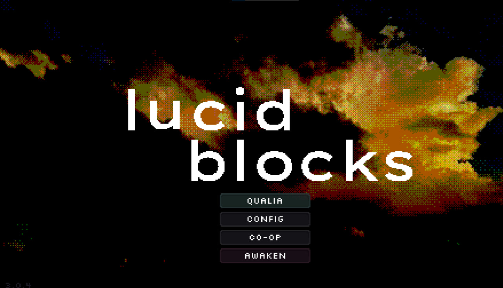
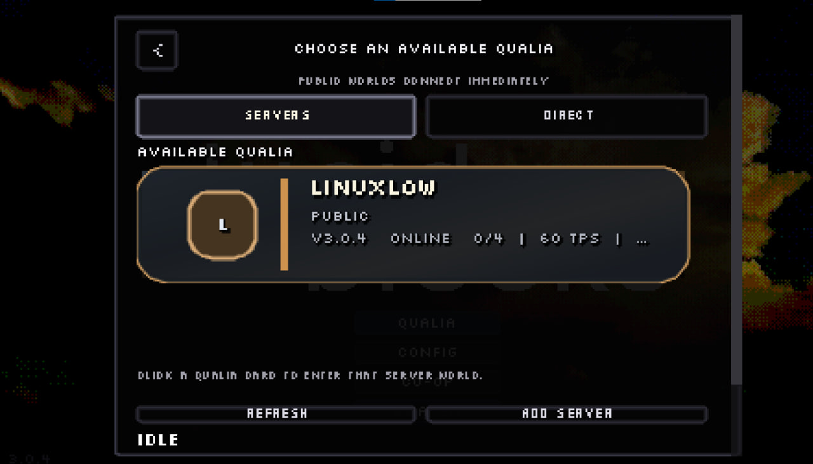
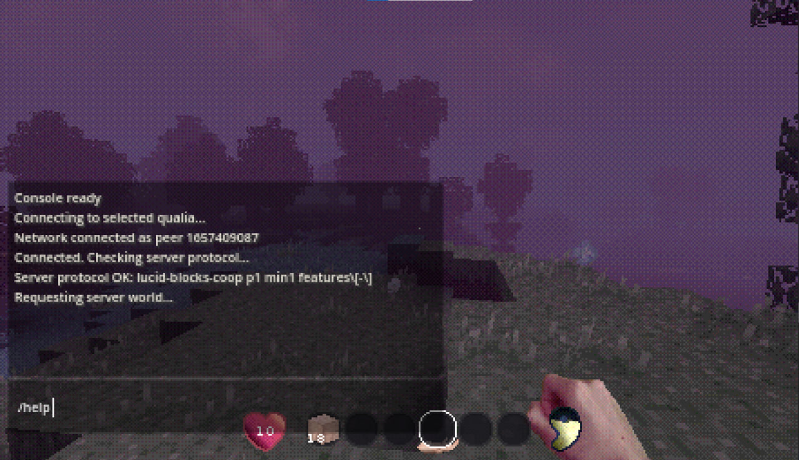

# Как дать мод другу

Это инструкция для установки MVP-сборки Lucid Blocks Multiplayer. Нужна
легальная Steam-копия Lucid Blocks. Не смешивайте свежий пакет со старыми
debug/co-op `.pck`.

## Что отправить

Отправь другу файл:

```text
lucid-blocks-multiplayer.pck
```

Если отправляешь release archive, внутри должен быть именно этот `.pck`.

Если в архиве есть `lucid_blocks_server_registry.json`, положи его в ту же папку `mods`.
Это список серверов для свежего клиента: без него новый игрок увидит пустой список,
пока не добавит сервер вручную.

## Установка

1. Закрыть Lucid Blocks.
2. Открыть папку игры в Steam: `Library -> Lucid Blocks -> Manage -> Browse local files`.
3. Найти или создать папку `mods`.
4. Удалить старые multiplayer/co-op тестовые пакеты, если они там есть:

```text
lucid-blocks-coop-test.pck
lucid-blocks-coop-next.pck
lucid-blocks-coop-dedicated.pck
zz-lucid-blocks-coop*.pck
zzz-lucid-blocks-command-chat*.pck
```

5. Положить `lucid-blocks-multiplayer.pck` в `mods`.
6. Если есть `lucid_blocks_server_registry.json`, положить его рядом в `mods`.
7. Запустить игру.

## Подключение

1. В главном меню нажать `CO-OP`.
2. Открыть вкладку `SERVERS`.
3. Нажать на карточку сервера в `AVAILABLE QUALIA`.
4. Дождаться подключения и загрузки мира.








## Если не подключается

- Проверьте, что у обоих игроков одинаковая версия Lucid Blocks.
- Проверьте, что в `mods` лежит свежий `lucid-blocks-multiplayer.pck`.
- Удалите старые co-op/debug пакеты.
- Перезапустите игру после замены `.pck`.
- Если один игрок заходит, а второй нет, пришлите имя сервера, время попытки и скрин текста ошибки.

## Важно

Мир сервера считается серверным миром. Не надо открывать тот же сейв локально в
singleplayer и потом вручную мержить прогресс. Игроки заходят в серверный мир
через `CO-OP`.
